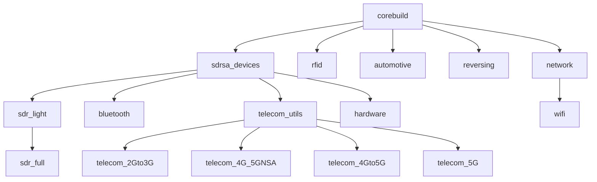

# 🚀 RF Swift 📡

<div align="center">
  
  <br><br>
  
  
  
  
  <br>
  
  
  
  <br><br>
  
  
  <br><br>
   <a target="_blank" rel="noopener noreferrer" href="https://www.blackhat.com/eu-24/arsenal/schedule/index.html#rf-swift-a-swifty-toolbox-for-all-wireless-assessments-41157" title="Schedule">
   
  </a>
  <a target="_blank" rel="noopener noreferrer" href="https://spectrum-conference.org/24/schedule" title="Schedule">
   
  </a>
  <a target="_blank" rel="noopener noreferrer" href="https://fosdem.org/2025/schedule/event/fosdem-2025-4301-rf-swift-a-swifty-toolbox-for-all-wireless-assessments/" title="Schedule">
   
  </a>
  <a target="_blank" rel="noopener noreferrer" href="https://www.cyberonboard.org/en/content/sujetsscientifiques" title="Schedule">
   
  </a>
  <a target="_blank" rel="noopener noreferrer" href="https://www.prasec.cz/index.html#topics" title="Schedule">
   
  </a>
  <br><br>
  <a target="_blank" rel="noopener noreferrer" href="https://x.com/intent/follow?screen_name=FlUxIuS" title="Follow"></a>
  <a target="_blank" rel="noopener noreferrer" href="https://x.com/intent/follow?screen_name=Penthertz" title="Follow"></a>
  <br><br>
  <a target="_blank" rel="noopener noreferrer" href="https://discord.gg/NS3HayKrpA" title="Join us on Discord"></a>
  <br><br>
</div>


https://github.com/user-attachments/assets/518c5045-4380-48d0-a731-6ec0273a02c5


## 🔍 What is RF Swift?

RF Swift is a revolutionary toolbox that transforms any computer into a powerful RF testing laboratory without requiring a dedicated operating system. 🔄 Unlike traditional approaches that force you to sacrifice your primary OS, RF Swift brings containerized RF tools to your existing environment. 🏠

### ⚡ Why RF Swift Outperforms Dedicated OS Solutions

| Feature | RF Swift | Dedicated OS |
|---------|---------|------------------------------|
| **🏠 Host OS Preservation** | ✅ Keep your existing OS | ❌ Requires dedicated partition or VM |
| **🛡️ Tool Isolation** | ✅ Tools contained without system impact | ❌ Tools can destabilize system |
| **⚡ Deployment Speed** | ✅ Seconds to deploy | ❌ Hours for full installation |
| **💾 Disk Space** | ✅ Only install tools you need | ❌ Requires 20-50GB minimum |
| **🔄 Updates** | ✅ Update individual tools without risk | ❌ System-wide updates can break functionality |
| **🌐 Multi-architecture** | ✅ x86_64, ARM64, RISCV64 and more! | ❌ Limited architecture support |
| **🔁 Reproducibility** | ✅ Identical environments everywhere | ❌ System drift between other installations |
| **💼 Work Environment** | ✅ Use alongside productivity tools | ❌ Switch contexts between systems |
| **📹 Session Recording** | ✅ Built-in recording for documentation | ❌ Manual setup required |
| **🎨 Easy Customization** | ✅ Simple YAML recipes for custom images | ❌ Complex OS modifications |

## ✨ Key Features

### Core Capabilities
- **🏠 Non-disruptive Integration**: Run specialized RF tools while continuing to use your preferred OS for daily work
- **🧩 Modular Tool Selection**: Deploy only the tools you need, when you need them
- **🛡️ Containerized Isolation**: Prevent RF tools from affecting system stability or security
- **🌍 Cross-platform Compatibility**: Works seamlessly on Linux, Windows, and macOS
- **🔌 Dynamic Hardware Integration**: Connect and disconnect USB devices without restarting
- **⚡ GPU Acceleration**: Dedicated images with OpenCL support for Intel and NVIDIA GPUs
- **💾 Space Efficiency**: Use a fraction of the disk space required by dedicated OS solutions

### 🐳🦭 Container Engine Support

RF Swift supports **both Docker and Podman** as container engines, giving you the freedom to choose the runtime that best fits your environment:

| | Docker | Podman |
|---|---|---|
| **Architecture** | Client-server daemon | Daemonless, fork-exec |
| **Root required** | Yes (daemon runs as root) | No (rootless by default) |
| **Compatibility** | Industry standard | OCI-compatible, drop-in replacement |
| **Best for** | Broad ecosystem, Windows/macOS | Security-focused, air-gapped, embedded |

#### Auto-detection

RF Swift **automatically detects** the available container engine at startup. If both are installed, Docker is used by default. Override with:

```bash
rfswift --engine podman run -n mycontainer -i penthertz/rfswift:sdr_light
rfswift --engine docker run -n mycontainer -i penthertz/rfswift:sdr_light
```

#### Podman support example

https://github.com/user-attachments/assets/14b6d50f-5250-420e-94e4-474991113372

#### Podman Highlights

- **Rootless containers**: No daemon, no root — ideal for locked-down environments and shared lab machines
- **OCI-compatible images**: All existing RF Swift images work out of the box with Podman
- **Seamless device passthrough**: USB SDR dongles, serial adapters, and GPUs work with both engines


- **Automatic cgroup handling**: RF Swift detects cgroup v1/v2 and configures device access rules accordingly

#### Quick Setup

```bash
# Install with the interactive installer (offers Docker, Podman, or both)
curl -fsSL "https://get.rfswift.io/" | sh

# Or install Podman manually
sudo apt install podman          # Debian/Ubuntu
sudo dnf install podman          # Fedora/RHEL
sudo pacman -S podman            # Arch Linux
brew install podman              # macOS
```

> **Note**: When using Podman in rootless mode, some operations (like direct device passthrough) may require additional configuration. RF Swift handles most of this automatically, but see the [documentation](https://rfswift.io/docs/guide/) for details.

## 🎬 Demo Videos

### 🐧 On Linux
https://github.com/PentHertz/RF-Swift/assets/715195/bb2ccd96-b688-4106-8fba-d82f84ff1ea4

### 🪟 On Windows (With GQRX)
https://github.com/PentHertz/RF-Swift/assets/715195/25a4a857-aa5a-4daa-9a08-28fa53d2f799

### 🖥️ Using OpenCL with Intel or NVIDIA GPU


## 📦 Available Specialized Images

RF Swift's container approach allows for specialized environments optimized for specific tasks. All images are **OCI-compatible** and work with both **Docker and Podman**.



| Category | Images | Key Tools |
|----------|--------|-----------|
| 📻 **SDR** | `sdr_light`, `sdr_full` | GNU Radio, GQRX, SDR++, SDRangel, SigDigger, CyberEther, Inspectrum, URH, rtl_433, dump1090, GNSS-SDR, SatDump, Jupyter + 50+ GNU Radio OOT modules (gr-gsm, gr-lora, gr-satellites, gr-ieee802-11, gr-droneid, gr-tempest, …) |
| 📡 **SDR Devices** | `sdrsa_devices` | Drivers for USRP (UHD), RTL-SDR, HackRF, BladeRF, Airspy, LimeSDR, PlutoSDR, XTRX, RFNM, HydraSDR, LiteX M2SDR, SignalHound, Harogic, LibreSDR, SoapySDR |
| 📱 **Telecom** | `telecom_utils`, `telecom_2Gto3G`, `telecom_4G_5GNSA`, `telecom_4Gto5G`, `telecom_5G` | PySIM, pycrate, srsRAN 4G/5G, Open5GS, UERANSIM, YateBTS, OpenBTS, OsmoCom BTS Suite, SigPloit, PyHSS, SCAT, jSS7, 5Greplay |
| 📶 **Bluetooth** | `bluetooth` | BlueZ, WHAD, Mirage, Sniffle, Bluing, bdaddr, ice9-bluetooth, esp32 BT Classic sniffer |
| 📡 **Wi-Fi** | `wifi` | Aircrack-ng, hcxdumptool, Reaver, Bully, Pixiewps, EAPHammer, Airgeddon, Wifite2, WPA3 attack suite (Dragonslayer/Dragonforce/Wacker), Hostapd-mana, Wifiphisher |
| 🏷️ **RFID** | `rfid` | Proxmark3 (RRG/Iceman), libnfc, mfoc, mfcuk, RFIDler, miLazyCracker |
| 🚗 **Automotive** | `automotive` | can-utils, CANtact, Caring Caribou, SavvyCAN, Gallia, V2GInjector |
| 🔧 **Hardware** | `hardware` | PulseView, DSView, Logic 2 (Saleae), Arduino IDE, Flashrom, OpenOCD, esptool, openFPGALoader, MTKClient, ngscopeclient, dfu-util, SeerGDB, AVRDUDE |
| 🔍 **Reversing** | `reversing` | Ghidra, Radare2, Cutter, ImHex, Binwalk (v2+v3), Unblob, AFL, Honggfuzz, Semgrep, Joern, Kaitai Struct, Qiling, Unicorn/Keystone |
| 🌐 **Network** | `network` | Nmap, Wireshark, Metasploit, Burp Suite, Caido, Impacket, NetExec, Responder, Hashcat, John the Ripper, Kismet, Bettercap, SIPVicious, MBTget |

> **200+ tools** across 15+ images, all on **x86_64**, **ARM64**, and **RISC-V64**.

Full image list with detailed tool inventory available at [rfswift.io/docs/guide/list-of-tools/](https://rfswift.io/docs/guide/list-of-tools/)

## 🌟 Real-World Use Cases

### 👔 For Professionals

- **🧰 Rapid Assessment Deployment**: Deploy a complete RF lab at client sites in minutes
- **🔄 Consistent Environments**: Eliminate "works on my machine" issues
- **⚙️ Parallel Testing**: Run multiple isolated assessments simultaneously
- **📹 Documentation**: Built-in session recording for client reports
- **🛠️ Custom Toolsets**: Create specialized containers for specific engagements

### 🔬 For Researchers

- **📊 Reproducible Research**: Share exact tool environments with papers
- **🧪 Experiment Isolation**: Keep experimental configurations separate
- **🌐 Multi-platform Collaboration**: Work across Linux, Windows, and macOS
- **🔢 Version Control**: Test with specific tool versions for reproducibility
- **⚡ Resource Optimization**: Allocate resources based on research needs

### 👨‍🏫 For Educators

- **🏫 Classroom Deployment**: Identical environments for all students
- **💻 No OS Reinstall**: Students keep their existing operating systems
- **🖥️ Low Requirements**: Works on standard lab computers
- **📚 Focused Learning**: Custom containers for specific lessons
- **🔄 Quick Reset**: Easily reset environments between classes

### 🏭 For Manufacturing & QA

- **🔍 Production Testing**: Consistent RF testing environments
- **📡 Device Validation**: Test wireless product compliance
- **🔧 Firmware Analysis**: Isolated environments for firmware testing
- **📊 Quality Assurance**: Reproducible test configurations

### 🔒 For Security-Conscious Environments

- **🦭 Rootless with Podman**: No privileged daemon required — ideal for SOC-compliant and hardened systems
- **🏔️ Air-gapped labs**: Pre-pull images, deploy without internet using Podman's daemonless architecture
- **🛡️ Minimal attack surface**: No long-running daemon socket to protect

## 📖 Documentation

Comprehensive documentation is available at [rfswift.io](https://rfswift.io/), including:

- 🚀 [Getting Started Guide](https://rfswift.io/docs/getting-started/)
- 🏁 [Quick Start Tutorial](https://rfswift.io/docs/quick-start/)
- 📘 [User Guide](https://rfswift.io/docs/guide/)
- 📝 [YAML Recipe Guide](https://rfswift.io/docs/development/yaml-recipe-guide/)
- 👨‍💻 [Development Documentation](https://rfswift.io/docs/development/)
- 🧰 [List of Included Tools](https://rfswift.io/docs/guide/list-of-tools/)
- 🛡️ [Security Guidelines](https://rfswift.io/docs/security/)

## 🎓 Training & Workshops

RF Swift is used in professional training courses by Penthertz:
- 📻 Software Defined Radio assessments
- 📱 Mobile network security testing
- 🚗 Automotive security analysis
- 🏭 IoT and embedded device testing

[Contact us](https://penthertz.com/) for custom training programs.

## 👥 Community & Support

- 💬 [Join our Discord](https://discord.gg/NS3HayKrpA) for community support and discussions
- 🐛 [Report issues](https://github.com/PentHertz/RF-Swift/issues) on GitHub
- 💡 [Request features](https://github.com/PentHertz/RF-Swift/discussions) via GitHub Discussions
- 🐦 Follow us on X (Twitter): [@FlUxIuS](https://x.com/FlUxIuS) and [@Penthertz](https://x.com/Penthertz)
- 📧 Professional inquiries: [penthertz.com](https://penthertz.com/)

## 🤝 Contributing

We welcome contributions! Here's how you can help:

### Code Contributions
- 🧰 **Tool Integration**: Add new tools or improve existing ones
- 🐞 **Bug Fixes**: Submit PRs to fix reported issues
- ✨ **New Features**: Implement new capabilities
- 📝 **Documentation**: Improve guides and examples

### Community Contributions
- 📝 **YAML Recipes**: Share your custom image recipes
- 🎓 **Tutorials**: Create guides for specific tools or workflows
- 🐛 **Bug Reports**: Report issues you encounter
- 💡 **Feature Requests**: Suggest improvements

### Getting Started with Contributing

1. Fork the repository
2. Create a feature branch (`git checkout -b feature/amazing-feature`)
3. Commit your changes (`git commit -m 'Add amazing feature'`)
4. Push to the branch (`git push origin feature/amazing-feature`)
5. Open a Pull Request

## ⚖️ License

RF Swift is released under the GNU General Public License v3.0. See [LICENSE](LICENSE) file for details.

## 🙏 Acknowledgments

Special thanks to:
- All contributors and clients who have helped improve RF Swift
- The open-source RF and security tool developers whose work we integrate
- The community for feedback, bug reports, and feature requests
- Conference organizers who have hosted our presentations
