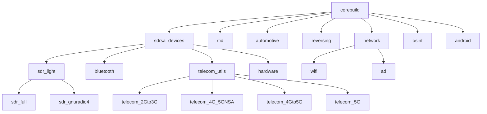

# 🚀 RF Swift 📡

<div align="center">
  
  <br><br>
  
  
  
  
  <br>
  
  
  
  <br><br>
  
  
  
  
  <br><br>
   <a target="_blank" rel="noopener noreferrer" href="https://www.blackhat.com/eu-24/arsenal/schedule/index.html#rf-swift-a-swifty-toolbox-for-all-wireless-assessments-41157" title="Schedule">
   
  </a>
  <a target="_blank" rel="noopener noreferrer" href="https://spectrum-conference.org/24/schedule" title="Schedule">
   
  </a>
  <a target="_blank" rel="noopener noreferrer" href="https://fosdem.org/2025/schedule/event/fosdem-2025-4301-rf-swift-a-swifty-toolbox-for-all-wireless-assessments/" title="Schedule">
   
  </a>
  <a target="_blank" rel="noopener noreferrer" href="https://www.cyberonboard.org/en/content/sujetsscientifiques" title="Schedule">
   
  </a>
  <a target="_blank" rel="noopener noreferrer" href="https://www.prasec.cz/index.html#topics" title="Schedule">
   
  </a>
  <br><br>
  <a target="_blank" rel="noopener noreferrer" href="https://x.com/intent/follow?screen_name=FlUxIuS" title="Follow"></a>
  <a target="_blank" rel="noopener noreferrer" href="https://x.com/intent/follow?screen_name=Penthertz" title="Follow"></a>
  <br><br>
  <a target="_blank" rel="noopener noreferrer" href="https://discord.gg/NS3HayKrpA" title="Join us on Discord"></a>
  <br><br>
</div>


https://github.com/user-attachments/assets/518c5045-4380-48d0-a731-6ec0273a02c5


## 🔍 What is RF Swift?

RF Swift builds you a **complete hardware and RF security lab in seconds** - on the machine you already use. 🔄 From a ham shack on a Sunday afternoon to a full James Bond-grade engagement on Monday morning: same tool, different image.

Unlike traditional approaches that force you to sacrifice your primary OS, RF Swift brings **200+ RF, hardware and security tools** to your existing environment, as containers or as native Nix environments - on Linux, Windows and macOS, across x86_64, ARM64 and RISC-V64. 🏠 On Linux and macOS the native environments come in two flavours: as your user with your files and devices, or **isolated** in a jail (bubblewrap on Linux, Seatbelt on macOS) that hides your home and the host filesystem while the radios, the display and the network keep working.

> **🆕 v4.0 "Nucleus"** (current release v4.0.2) - a native **Nix engine** that runs the tool sets without containers, the **RF Swift Workbench** desktop GUI for assessments, a **remote agent** to drive a lab machine from your laptop over mutual TLS, an **AI assistant** bridged into missions, a resource-first CLI with the old commands kept, built-in **security audits**, and native packages and installers for the three operating systems. See [What's new in v4.0](#-whats-new-in-v40-nucleus).

### ⚡ Why RF Swift Outperforms Dedicated OS Solutions

| Feature | RF Swift | Dedicated OS |
|---------|---------|------------------------------|
| **🏠 Host OS Preservation** | ✅ Keep your existing OS | ❌ Requires dedicated partition or VM |
| **🛡️ Tool Isolation** | ✅ Containers, or native environments with an optional jail | ❌ Tools can destabilize system |
| **⚡ Deployment Speed** | ✅ Seconds to deploy | ❌ Hours for full installation |
| **💾 Disk Space** | ✅ Only install tools you need | ❌ Requires 20-50GB minimum |
| **🔄 Updates** | ✅ Update individual tools without risk | ❌ System-wide updates can break functionality |
| **🌐 Multi-architecture** | ✅ x86_64, ARM64, RISCV64 and more! | ❌ Limited architecture support |
| **🔁 Reproducibility** | ✅ Identical environments everywhere | ❌ System drift between other installations |
| **💼 Work Environment** | ✅ Use alongside productivity tools | ❌ Switch contexts between systems |
| **📹 Session Recording** | ✅ Built-in recording for documentation | ❌ Manual setup required |
| **🎨 Easy Customization** | ✅ Simple YAML recipes for custom images | ❌ Complex OS modifications |
| **❄️ Native Option** | ✅ Nix engine: the same tool sets without a container, pinned and roll-backable | ❌ The OS is the environment |
| **🖥️ Ways to Work** | ✅ CLI, TUI wizards, desktop Workbench, remote lab machine | ❌ One desktop session |
| **🎯 One Tool, Not a Distro** | ✅ `rfswift env run sdr_light sdrpp` fetches one tool's closure; images are task-sized | ❌ A full system install to get one tool |

## 🆕 What's new in v4.0 "Nucleus"

v4.0 (current release **v4.0.2**) is the biggest change since the project started. In one line: the same RF and hardware lab, now as containers **or** native environments, on your machine **or** on a remote one, from the terminal **or** from a GUI. The full list is in the [CHANGELOG](CHANGELOG.md) and on [rfswift.io](https://rfswift.io/docs/release-notes-v4/).

### ❄️ Nix engine: the tools without a container

`--engine nix` installs a tool set straight onto the host as a reproducible, pinned Nix environment, with transactional updates and rollback generations and on-demand builds (`--lazy`). USB radios, audio and the GPU work with no device plumbing. On Linux and macOS the same environment also runs **isolated** on request (`--isolate`): a bubblewrap or Seatbelt jail that hides your home and the host filesystem and keeps the hardware. On Windows the engine runs inside WSL 2. The engine and its jail have their own section below.

### 🖥️ RF Swift Workbench

A desktop GUI for Linux, macOS and Windows that turns containers and environments into **missions**: terminals with asciinema recordings, a Markdown notebook, findings (pwndoc-compatible), captures with an artifact decoder and an offline CyberChef, secrets in the OS vault, reports, and the same security audits as the CLI. Missions are created with every option the CLI has, including an image version picker and a live Nix build log. Details below.

### 📡 Remote agent

`rfswift agent` serves the engines of a lab machine to authenticated clients: TLS 1.3 only, mandatory client certificates, a pinned server fingerprint, private keys encrypted with a password kept in the OS vault, and credential files that are integrity-checked on import. The Workbench connects to it and works on the remote machine as if it were local. Details below.

### 🤖 AI assistant in the loop

A mission can host Codex, Claude Code, Kimi Code or GLM in its own terminal, bridged to the mission through a scoped MCP server: read-only by default, with write and command access you switch on for a task. Details below.

### 🧭 Resource-first CLI

`rfswift --help` is grouped by resource: `container`, `image`, `env`, `config`, `network`, `host`, `usb`, `audit`, `agent`, `profile`, `realtime`, `engine` and `system`. **Every previous command keeps working** and prints a notice with its new spelling, so scripts and muscle memory are safe. Most commands open a TUI wizard when a required flag is missing (`rfswift container create` alone walks you through image, name and devices). Man pages and bash, zsh and fish completions ship with the Linux packages.

| Canonical (v4) | Legacy (still works) |
|---|---|
| `rfswift container create -i sdr_full -n work` | `rfswift run -i ... -n work` |
| `rfswift container shell -c work` | `rfswift exec -c work` |
| `rfswift image pull -i sdr_full` | `rfswift images pull -i ...` |
| `rfswift env update mysdr` | `rfswift nix update mysdr` |
| `rfswift usb attach` | `rfswift macusb attach`, `rfswift winusb attach` |
| `rfswift system doctor` | `rfswift doctor` |

Short image names resolve to the official repository, so `-i sdr_full` means `penthertz/rfswift_resolute:sdr_full`. Full reference: [rfswift.io/docs/commands](https://rfswift.io/docs/commands/).

### 🛡️ Security built in

`rfswift audit <target>` scans a Nix environment, an image or a running container and gates CI with `--fail-on`; the installer verifies every download against the release manifest and can check Sigstore build attestations; the macOS image is signed and notarized. Details below.

### 📦 Packages and installers

Native `rfswift` and `rfswift-workbench` packages (deb, rpm, pacman), a Homebrew cask and a signed DMG on macOS, a one-click bundle and an MSI on Windows. `rfswift host setup` handles the host steps a package should not decide for you: udev rules, Docker socket access, the Nix jail.

### 🔌 Hardware fixes that matter in the field

Serial ports hot-plug into running containers (`/dev/ttyACM*`, `/dev/ttyUSB*`, `/dev/ttyAMA*`), pre-creation checks list the devices an engine cannot map and what a container needs to reach USB, host audio loads at every start, container configuration edits work again on Linux Docker, and the RFID template maps the console the Proxmark3 client needs.

### 📀 Still in from v3.0.0 "Resonance"

The images keep everything the v3 release brought. Every official image (`penthertz/rfswift_resolute:*`) runs on **Ubuntu 26.04 "Resolute"** with GCC 15, CMake 4, Boost 1.90, Python 3.14 and Java 25, and **50+ GNU Radio out-of-tree modules** build on it thanks to forks we maintain publicly (gr-osmosdr, gr-gsm, gr-fosphor, gr-dvbs2, gr-nordic, gr-grnet, gr-pdu_utils, gr-sandia_utils, gr-fhss_utils, gr-timing_utils, srsRAN 4G, YATE, OpenBTS, OpenBTS-UMTS). The 5G SA stack runs on [OCUDU](https://gitlab.com/ocudu/ocudu) as the CU/DU while srsRAN 4G still covers 4G and 5G NSA, the `ad`, `android` and `osint` images cover full engagements, and `reversing` carries SAST/DAST tooling (Semgrep, Joern, cppcheck, honggfuzz, clang static analyzer, Trivy). GNU Radio 4 has its own image, so your 3.10 setup stays untouched:

```bash
rfswift container create -i sdr_gnuradio4 -n gr4
```

## 🖥️ RF Swift Workbench: the new GUI

The Workbench is the desktop side of RF Swift, new in v4.0. It is a native window on Linux, macOS and Windows (Go and the system webview, no bundled browser) that reuses the CLI's engine, audit and catalog code, so whatever the CLI does on Docker, Podman, Lima or Nix, the Workbench does with a click, and the two never disagree about a container. It is delivered by the same installers and packages: `RFSWIFT_INSTALL=both` with the script, the `rfswift-workbench` deb, rpm or pacman package, the portable AppImage, the Homebrew cask or DMG on macOS, and the Windows bundle or MSI.

Every container and Nix environment of every engine appears as a **mission**, and the panels around it hold what an assessment produces:

| Panel | What you get |
|---|---|
| **Missions** | One card per container or Nix environment, filtered by engine, with status, findings count and environment-audit posture at a glance |
| **Create** | The CLI's whole option set in a dialog: profiles and templates, image download with progress, an image version picker (Latest or a pinned release), devices and USB passthrough, network and ports, remote desktop, realtime, Nix build modes and version picker, a live Nix build log, and a Stop & clean that removes partial resources |
| **Console** | Real terminals in the target (zsh, bash, sh; Nix PTY; ConPTY on Windows), asciinema recordings in segments with an inline player, and read-only tabs that show what the AI agent runs |
| **Notebook** | A Markdown note per mission, WYSIWYG or source, screenshots pasted straight in, embedded terminal recordings, AI rewrites through your own coding agent |
| **Config & network** | The container summary the CLI prints, live: image freshness and the release it runs, mounts, devices with serial hot-plug state, capabilities, ports, workspace, desktop link |
| **Findings** | pwndoc-style vulnerabilities with a CVSS v3.1 calculator, priorities, retest status, proof of concept with images; import and export as pwndoc JSON |
| **Captures** | Import evidence, inventory the live workspace, register artifacts as AI-readable evidence, decode bytes with a native decoder stack or an offline CyberChef, read MIFARE Classic and Ultralight dumps |
| **Secrets** | Credentials collected during the assessment, stored in the OS vault only, excluded from every export |
| **Security posture** | The same scanners as `rfswift audit`, with a progress view, detailed CVE records and an AI-grounded review |
| **Reports** | Branded Markdown, HTML and PDF reports, pwndoc export and import |
| **Engine doctor** | Every engine's state, space reclaim, Lima VM lifecycle and settings, udev rules, Docker access, the Nix jail, host audio, Nix in WSL 2, WSLg display reset |
| **Remote** | Connect to a lab machine over pinned TLS 1.3 and mutual TLS; missions, terminals, audits, pulls, artifacts and USB passthrough run there |
| **Agent** | Codex, Claude Code, Kimi Code or GLM connected to the mission through a local, permission-gated MCP bridge; RF Swift never calls a model API itself |

Missions travel: **Export archive** produces the container or environment archive plus a mission companion with notes, captures, findings, reports, recordings and audits, and **Import** restores the lot on another machine. Start the Workbench from your application menu ("RF Swift Workbench") or with `rfswift-workbench`; it needs the engines the CLI uses, and its Engine doctor sets them up when something is missing.

Guide and tour: [rfswift.io/docs/guide/workbench](https://rfswift.io/docs/guide/workbench/). Architecture and security review: [docs/workspace-gui.md](docs/workspace-gui.md), [docs/workbench-security-audit.md](docs/workbench-security-audit.md).

## ✨ Key Features

### Core Capabilities
- **🏠 Non-disruptive Integration**: Run specialized RF tools while continuing to use your preferred OS for daily work
- **🧩 Modular Tool Selection**: Deploy only the tools you need, when you need them
- **🛡️ Containerized Isolation**: Prevent RF tools from affecting system stability or security
- **🌍 Cross-platform Compatibility**: Works seamlessly on Linux, Windows, and macOS
- **🔌 Dynamic Hardware Integration**: Connect and disconnect USB devices, ports, capabilities, and resources without recreating containers
- **🌐 NAT Networking**: Isolated container networks with configurable subnets for multi-container RF lab setups
- **📋 Container Profiles**: YAML presets for quick deployment of preconfigured container environments
- **⚡ GPU Acceleration**: Dedicated images with OpenCL support for Intel and NVIDIA GPUs
- **💾 Space Efficiency**: Use a fraction of the disk space required by dedicated OS solutions
- **❄️ Native Nix Environments**: The same tool sets installed natively, pinned, updatable and roll-backable, with an optional jail
- **🖥️ Workbench GUI**: Missions with terminals, recordings, notes, findings, captures and reports, on Linux, macOS and Windows
- **📡 Remote Agent**: Drive the engines of a lab machine from your laptop over mutual TLS
- **🤖 AI Assistant**: Codex, Claude Code, Kimi Code or GLM inside a mission, through a scoped MCP bridge
- **🛡️ Built-in Audits**: One command scans an image, a container or a Nix environment for CVEs and attack surface
- **📌 Pinned Image Versions**: Follow the latest build or pin a published release, from the CLI or the Workbench

### 🐳🦭 Container Engine Support

RF Swift supports **Docker, Podman and Lima** as container engines, and (since v4.0) a **Nix** engine that installs the tools natively instead of in a container. Choose the runtime that best fits your environment:

| | Docker | Podman | Lima |
|---|---|---|---|
| **Architecture** | Client-server daemon | Daemonless, fork-exec | Docker inside QEMU VM |
| **Root required** | Yes (daemon runs as root) | No (rootless by default) | No (VM managed by Lima) |
| **USB passthrough** | Linux; Windows via usbipd + WSL 2 | Linux; Windows via usbipd + WSL 2 | macOS via QMP hot-plug |
| **Best for** | Broad ecosystem, Windows/macOS | Security-focused, air-gapped | macOS + USB RF hardware |

#### Auto-detection

RF Swift **automatically detects** the available engine at startup. If several are installed, Docker is used by default. Override with the flag, the `RFSWIFT_ENGINE` variable, or `[general] engine` in `config.ini`:

```bash
rfswift --engine podman container create -n mycontainer -i sdr_light
rfswift --engine docker container create -n mycontainer -i sdr_light
rfswift --engine lima container create -n mycontainer -i sdr_light   # macOS USB
rfswift --engine nix container create -n myenv -i sdr_light          # native, no container
export RFSWIFT_ENGINE=podman                                          # for the whole shell session
```

#### Podman support example

https://github.com/user-attachments/assets/14b6d50f-5250-420e-94e4-474991113372

#### Podman Highlights

- **Rootless containers**: No daemon, no root - ideal for locked-down environments and shared lab machines
- **OCI-compatible images**: All existing RF Swift images work out of the box with Podman
- **Seamless device passthrough**: USB SDR dongles, serial adapters, and GPUs work with both engines


- **Automatic cgroup handling**: RF Swift detects cgroup v1/v2 and configures device access rules accordingly

### ❄️ Nix engine (native environments)

New in v4.0.0. Instead of a container, the Nix engine installs an RF Swift tool set straight onto the host as a reproducible, pinned environment. No daemon, no container boundary, so USB radios and audio work with zero device plumbing. The environments (`sdr_light`, `rfid`, `wifi`, ...) are defined in the companion repo [RF-Swift-nix](https://github.com/PentHertz/RF-Swift-nix).

```bash
rfswift container create --engine nix                              # interactive wizard
rfswift container create --engine nix -i sdr_light -n mysdr        # or the full command
rfswift container create --engine nix -i sdr_light -n lab --isolate   # inside the jail
rfswift env shell mysdr                                            # re-enter it

rfswift env catalog                            # browse available environments
rfswift env list                               # environments you created
rfswift env install soapyrtlsdr --env mysdr    # add any nixpkgs package to one environment
rfswift env update --check mysdr               # preview pinned input updates
rfswift env update --input nixpkgs mysdr       # update nixpkgs and safely rebuild
rfswift env rebuild mysdr                      # rebuild without changing flake.lock
rfswift env generations mysdr                  # list rollback points
rfswift env rollback mysdr                     # restore the previous closure
rfswift env export mysdr -o mysdr.rfenv        # move it to another machine
```

Tools can build on first use (`--lazy`), and `--isolate` runs the environment in a bubblewrap jail on Linux or a Seatbelt sandbox on macOS that hides your home and the host filesystem while keeping USB, display and network. Requires a [Nix](https://nixos.org/download) install with flakes on Linux and macOS (`rfswift host setup` offers to install it). On Windows the engine runs inside a WSL 2 distribution that `rfswift env wsl setup` (or the installer) provisions, and the same commands work from any Windows console and from the Workbench. The `rfswift nix ...` spellings from v3 still work. Prebuilt binaries come from cache.nixos.org and, with a token, from the PentHertz binary cache; a team can run its own cache or image registry ([Caches and fast delivery](https://rfswift.io/docs/guide/caches/)). Full guide: [docs/nix-engine.md](docs/nix-engine.md).

#### 🔒 Native, and isolated when you want it: the `--isolate` jail

On Linux and macOS the Nix engine gives you both. By default an environment runs natively, as your user, with your files, network and devices, which is what makes it good at driving real hardware; it is not a sandbox, and a vulnerable or untrusted tool has the same reach you do. `--isolate` puts the same environment in a jail. The choice is stored on the environment, so every later entry, from the CLI, the Workbench terminal or a script, lands in the same jail.

| | Linux | macOS |
|---|---|---|
| **Backend** | bubblewrap with unprivileged user namespaces | Apple's Seatbelt sandbox (`sandbox-exec`, part of the OS) |
| **Hidden** | Your home, the host filesystem, host processes (own PID, IPC and UTS namespaces), a private `/tmp` | Every user home; files keep their real paths, no PID namespace or private `/tmp` |
| **Visible** | The workspace at `/workspace`, the environment's state read-only, a private home | The workspace read-write, the environment's state read-only, a private per-environment home |
| **Kept for the tools** | The `/nix` store, USB and serial devices, the display, the network with name resolution | Same |

Sibling environments and other workspaces, with their captures and evidence, are hidden too. Verified with a HydraSDR: visible to `lsusb` and openable inside the jail while `$HOME`, SSH keys and host processes are not.

```bash
rfswift container create --engine nix -i sdr_light -n lab --isolate
rfswift host isolate        # Ubuntu 24.04+: the distribution's bubblewrap and its AppArmor profile, one sudo
```

Ubuntu 24.04 and later restrict unprivileged user namespaces with AppArmor, so a Nix-built bubblewrap fails with `bwrap: setting up uid map: Permission denied`. `rfswift host isolate` installs the distribution's bubblewrap and the profile that allows it, the installer tests the sandbox on every run, `rfswift system doctor` has a check for it, and the Workbench's Engine doctor has an "Enable sandbox" button. Running with `sudo` is not the fix. Details and limits: [docs/nix-engine.md](docs/nix-engine.md) and [rfswift.io/docs/guide/nix-engine](https://rfswift.io/docs/guide/nix-engine/#isolation-the---isolate-jail).

### 🦙 macOS USB Passthrough (Lima)

Docker Desktop and Podman on macOS **cannot forward USB devices** (SDR dongles, HackRF, RTL-SDR, etc.) into containers. RF Swift solves this with **Lima**, which runs a QEMU VM with USB hot-plug support:

```bash
# Install QEMU + official Lima (USB passthrough works via the VM's video.display)
brew install qemu lima

# Attach your SDR dongle to the Lima VM
rfswift usb list                              # see host USB devices
rfswift usb attach --vid 0x1d50 --pid 0x604b  # forward HackRF to the VM (a picker when omitted)

# Run the container through Lima's Docker (where the USB device lives)
rfswift --engine lima container create -i sdr_light -n sdr_work

# When done, detach
rfswift usb detach --vid 0x1d50 --pid 0x604b
```

Lima auto-creates the VM on first use with Docker, USB libraries, kernel modules, and udev rules for all supported RF hardware pre-configured; `rfswift engine lima set` changes its CPU, memory and disk. Use `--engine lima` when you need USB devices; use Docker Desktop normally for everything else.

#### 🖥️ GUI tools on macOS (XQuartz)

Containers show their windows through [XQuartz](https://www.xquartz.org) (`scripts/setup-xquartz-macos.sh` installs and configures it). XQuartz's GLX cannot give Mesa a usable OpenGL context, so RF Swift tells the container (`RFSWIFT_GL_PLATFORM=egl`) to create OpenGL contexts through EGL instead: Qt and SDL switch on their own, and a small preloaded shim does the same for GLFW programs (SDR++, SatDump, CyberEther, ...). Rendering is software (llvmpipe) and works with Docker Desktop, Podman and Lima alike. It needs images built after this change; older images keep failing with `GLX: Failed to create context`, in which case `--desktop` (noVNC) is the alternative.

#### 🎮 GPU acceleration on Apple Silicon (opt-in)

On Apple Silicon, **USB passthrough and GPU acceleration need different VM backends and cannot coexist in one VM**. The Lima VM above uses QEMU for USB/SDR devices. For GPU compute (e.g. Vulkan-accelerated ML/DSP) there is a separate opt-in profile that uses the **krunkit** backend (libkrun), which exposes the Apple GPU to containers as a **Vulkan** device (Mesa Venus -> MoltenVK -> Metal). It is **Vulkan, not CUDA**, and provides **no** USB passthrough.

```bash
# One-time: install Lima + the krunkit backend
brew install lima
brew tap slp/krunkit && brew install krunkit

# Run a container in the GPU VM (auto-created on first use). --gpu implies --engine lima
# and uses a separate instance (rfswift-gpu), leaving your USB/SDR VM untouched.
rfswift --gpu container create -i sdr_light -n gpu_work --devices /dev/dri
```

Use `--gpu` for GPU compute; use `--engine lima` (without `--gpu`) for SDR hardware. Requires macOS 14 or later and a guest kernel with virtio-gpu Venus support (Linux 6.13 or later).

### 🪟 Windows install (one-click MSI + dependency bundle)

Two Windows deliverables ship with each release:

- **`RFSwift-Setup-<version>-<arch>.exe`** (x64 + arm64) - a bundle that installs, under a **single** UAC prompt, the prerequisites you pick on one screen: **WSL 2 + WSLg**, **usbipd-win** (USB/SDR passthrough), a **container engine** (Docker Desktop by default, or Podman Desktop, or "I already have one", or "Nix only" which skips engines and sets up Nix), an optional **Nix in WSL 2** for native environments driven by `rfswift.exe` and the Workbench, and RF Swift itself. Everything already present is skipped.
- **`RFSwift-<version>-<arch>.msi`** (x64 + arm64) - RF Swift on its own (CLI on `PATH`, an "RF Swift Console" and "RF Swift Workbench" in the Start Menu), for enterprise deployment (Intune/GPO) or machines that already have the prerequisites.

After it runs, `rfswift` works from any console and the Workbench opens from the Start Menu. Details, silent-install switches and the trust model: [docs/windows-installer.md](docs/windows-installer.md).

### 🪟 Windows USB Passthrough (usbipd + WSL 2)

On Windows, Docker Desktop and Podman run their containers inside the WSL 2 VM, which cannot see the host USB bus. RF Swift forwards devices into that VM with [usbipd-win](https://github.com/dorssel/usbipd-win) (`winget install usbipd`). Only *sharing* a device for the first time needs administrator rights; RF Swift asks for them through a normal UAC prompt for `usbipd.exe`, once per device. Attaching and detaching never need elevation.

```powershell
rfswift usb status                     # usbipd-win, WSL 2 distribution, shared devices
rfswift usb list                       # host devices with their usbipd state
rfswift usb attach                     # picker: shares (UAC, once) then attaches to WSL 2
rfswift usb attach --busid 2-3         # or by bus ID; --yes allows the UAC prompt in scripts
rfswift container create -i sdr_light -n sdr_work   # sees /dev/bus/usb
rfswift usb detach --busid 2-3         # give the device back to Windows
```

`rfswift container create` offers the same picker when it detects shared or known RF hardware, and the Workbench exposes it as **USB passthrough...** on Docker/Podman missions. A forwarded device is visible to every WSL 2 distribution, including Docker Desktop's, because they share one kernel.

Inside the container, `/dev/bus/usb` must be mapped **and** USB device major 189 allowed (`c 189:* rwm`) - both are part of the RF Swift defaults. A bind mount alone lists the devices but cannot open them, and **privileged mode is not required**; `rfswift container create` and the Workbench mission form check this before creating the container and tell you what is missing.

#### 🔊 Sound and display on Windows (WSLg)

No PulseAudio install and no `rfswift host audio enable` on Windows: WSLg already runs an X11 server and a PulseAudio server for the WSL 2 VM, and RF Swift mounts its `/mnt/wslg` tree into every container with `DISPLAY=:0` and `PULSE_SERVER=unix:/mnt/wslg/PulseServer`. GQRX, SDR++ and friends play through your Windows audio device. If `rfswift system doctor` cannot find the WSLg sockets, run `wsl --update` followed by `wsl --shutdown`.

#### ❄️ Nix engine on Windows (inside WSL 2)

Nix has no Windows port, so the Nix engine lives inside a WSL 2 distribution and RF Swift drives it for you: the same `rfswift container create --engine nix` and `rfswift env ...` commands work from PowerShell, and the Workbench shows Nix missions like on Linux. Radios forwarded with `rfswift usb attach` (offered by `container create` and `container shell`, and by the Workbench's **USB passthrough...** action on Nix missions) and WSLg's display, sound and GPU libraries reach the environments; `rfswift env udev <name>` or **Install device rules** grants non-root access to the hardware.

```powershell
rfswift env wsl setup                                        # systemd, Nix (flakes) and the Linux rfswift in the distro
rfswift env wsl status                                       # distro, nix, rfswift, WSLg, forwarded USB devices
rfswift container create --engine nix -i sdr_light -n lab    # served by the Linux rfswift inside WSL 2
rfswift env install gnuradioPackages.gr-foo --env lab
```

The installer's optional **Set up Nix in WSL 2** step does the provisioning too. Details: [docs/nix-engine.md](docs/nix-engine.md#windows-the-engine-runs-in-wsl-2).

## 📥 Install

Current release: **v4.0.2**. Every artifact below comes from the [releases page](https://github.com/PentHertz/RF-Swift/releases); the script downloads from there too.

| Platform | Ways to install |
|---|---|
| 🐧 **Linux** | The install script (below), or the `rfswift` and `rfswift-workbench` deb, rpm and pacman packages, or the portable Workbench AppImage on x86-64 |
| 🍎 **macOS** | The same install script, or `brew install --cask penthertz/rfswift/rfswift`, or the signed and notarized DMG from the releases (CLI and Workbench, with launchers) |
| 🪟 **Windows** | `RFSwift-Setup-<version>-<arch>.exe`, the one-click bundle that also installs WSL 2, usbipd-win, a container engine and Nix; or `RFSwift-<version>-<arch>.msi` for RF Swift alone |

```bash
# Linux and macOS: interactive installer. CLI, Workbench or both; Docker, Podman, Nix or several of them
curl -fsSL "https://raw.githubusercontent.com/PentHertz/RF-Swift/refs/heads/main/scripts/get_rfswift.sh" | sh

# Non-interactive, for example both binaries with Podman and Nix
RFSWIFT_INSTALL=both RFSWIFT_ENGINE=podman RFSWIFT_NIX=1 sh -c "$(curl -fsSL https://raw.githubusercontent.com/PentHertz/RF-Swift/refs/heads/main/scripts/get_rfswift.sh)"

# Or install Podman manually
sudo apt install podman          # Debian/Ubuntu
sudo dnf install podman          # Fedora/RHEL
sudo pacman -S podman            # Arch Linux
brew install podman              # macOS
```

On a stock Debian install the first user is not in the `sudo` group (the installer says so and stops short of anything that needs root). Either run it from a root shell, which sets up the docker group and the alias for your desktop user, or grant sudo once:

```bash
su -                                   # then run the installer command above (wget -qO- ... | sh works too)
su - -c 'usermod -aG sudo $USER'       # or: give your user sudo, log out and back in
```

The installer prefers the native packages automatically (deb/rpm/pacman on Linux, the signed Homebrew cask on macOS) and falls back to a tarball install; set `RFSWIFT_PKG_FORMAT=native|tarball` to pick non-interactively. The same packages - `rfswift` (CLI/TUI, with man pages and bash/zsh/fish completions) and `rfswift-workbench` (desktop GUI) - can also be installed manually from the [releases page](https://github.com/PentHertz/RF-Swift/releases):

```bash
sudo apt install ./rfswift_<version>_amd64.deb            # Debian/Ubuntu
sudo dnf install ./rfswift-<version>-1.x86_64.rpm         # Fedora/RHEL
sudo pacman -U rfswift-<version>-1-x86_64.pkg.tar.zst     # Arch Linux
```

The packages pull in the two host tools every container needs, `xhost` (X11 authorisation) and `pactl` (host audio server), so GUI tools open a display and play sound without a manual step. Three host changes are left to you on purpose, and asked for rather than applied by the package:

```bash
rfswift host setup                 # asks each step; --yes takes the defaults
rfswift host udev                  # RF Swift's udev rules only (SDR/RF hardware without root)
rfswift host docker-access         # docker group + socket ACL, works without logging out
rfswift host isolate               # Nix jail (--isolate): bubblewrap and, on Ubuntu 24.04+, its AppArmor profile
```

The udev rules ship as a reference copy in `/usr/share/rfswift/udev/70-rfswift.rules` (and inside the binary). Rootless Podman and Nix environments run tools as your user and need them; Docker runs as root and does not. They grant group `plugdev` plus the logged-in user's seat ACL, never world-writable device nodes, and udev is reloaded on the spot. The setup wizard also offers to install Docker and/or Podman from your distribution's repositories, or to skip that and use the Nix engine. `get_rfswift.sh` asks the same questions (`RFSWIFT_INSTALL=cli|workbench|both`, `RFSWIFT_CHANNEL=stable|dev`, `RFSWIFT_UDEV=1|0`, `RFSWIFT_ENGINE=docker|podman|both|skip`, `RFSWIFT_NIX=1|0`, `RFSWIFT_ISOLATE=1|0` and `RFSWIFT_INSTALL_DIR=<dir>` answer up front), and the Workbench's **Engine doctor** has the same buttons behind a polkit prompt. They install `rfswift` in `/usr/bin`; the installer removes the copies an earlier tarball install left in `/usr/local/bin` or `~/.rfswift/bin` (and the shell alias pointing at them) when you agree, since those would shadow the packaged binary. A packaged `rfswift` is upgraded with the next package (or by re-running the installer), and `rfswift update` says so instead of overwriting it.

On macOS, Homebrew installs the CLI and the Workbench GUI together from the signed release, and the bundled setup command picks your engine:

```bash
brew install --cask penthertz/rfswift/rfswift
curl -fsSL "https://raw.githubusercontent.com/PentHertz/RF-Swift/main/scripts/setup-macos.sh" | bash
```

Without Homebrew, download the DMG from the releases: it is Developer ID signed and notarized, and carries the CLI, the Workbench and launchers that open a terminal with `rfswift` on the path ([docs/macos-signing.md](docs/macos-signing.md)). On Windows, the bundle and the MSI are described in the [Windows install section](#-windows-install-one-click-msi--dependency-bundle) above.

> **Verifying downloads**: The installer verifies every file's SHA-256 against the release manifest, always. When a recent, logged-in [GitHub CLI](https://cli.github.com) is present it also offers to check each file's Sigstore-backed **build provenance attestation** (`RFSWIFT_ATTEST=1|0` answers up front); without gh, or with gh not logged in, it prints the manual command and moves on rather than sending you through `gh auth login`. To verify by hand: `gh attestation verify <downloaded.tar.gz> --repo PentHertz/RF-Swift`. This proves the artifact was built by the official RF Swift release workflow from a specific commit - not swapped afterwards.

> **Note**: Rootless Podman runs containers as your user, so USB devices are only reachable once the host grants you access: install RF Swift's udev rules with `rfswift host udev` (rules inside a container are never evaluated). Root-only device nodes and realtime limits are dropped automatically with a notice; see the [documentation](https://rfswift.io/docs/guide/) for details.

## 📡 Remote agent

`rfswift agent` turns any machine with engines (an SDR rack in the lab, a Raspberry Pi next to the antenna, the Windows box with the only Proxmark) into a target the Workbench drives from your laptop: list its engines, create and configure missions there with live progress, open terminals, pull images, run audits, reclaim space and register remote captures as evidence.

```bash
# On the lab machine: keys and certificates, then serve on a private address
rfswift agent certs init --dir ~/.config/rfswift/remote/lab --name lab-agent --host lab.internal
rfswift agent --bundle ~/.config/rfswift/remote/lab --bind 192.168.10.5:8443

# Issue a credential file for one client; it travels under a passphrase
rfswift agent certs client --bundle ~/.config/rfswift/remote/lab --name laptop

# On the laptop: import it, then connect from the Workbench
rfswift agent certs import laptop-client.json --dir ~/.config/rfswift/remote/lab-client
```

The protocol is TLS 1.3 only with mandatory mutual TLS, a pinned server fingerprint, private keys encrypted with a password that lives in the OS vault, credential files sealed with an integrity tag, request and connection limits, and an access log of every authenticated call. Keep the agent behind a VPN or an SSH tunnel all the same. The trust model, what is and is not covered, and the hardening baseline are in [docs/remote-agent.md](docs/remote-agent.md) and the [security review](docs/remote-agent-security-audit-2026-09.md).

## 🤖 AI assistant (MCP)

A mission can open a terminal running **Codex**, **Claude Code**, **Kimi Code** or **GLM**, bridged to that mission through a scoped MCP server: the agent reads the mission's notes, findings, captures and audit reports, and can draft notes and report sections back. Access is read-only by default; write and command access are switched on for a task and off afterwards. Everything the agent reads is untrusted evidence that may carry injected instructions, and it is sent to the CLI vendor under your account, so keep sensitive engagements on a read-only bridge. Setup: [docs/ai-assistant.md](docs/ai-assistant.md). Practices: [rfswift.io/docs/security/mcp](https://rfswift.io/docs/security/mcp/).

## 🛡️ Security audits

```bash
rfswift audit wifi                                                     # a Nix environment
rfswift audit penthertz/rfswift_resolute:sdr_full --fail-on critical   # an image, as a CI gate
rfswift audit mysdr --type container --format json,html                # a running container
```

Environments get vulnix, syft, grype and osv-scanner plus integrity, provenance and hygiene checks; images get trivy and grype; containers get an attack-surface review (privileges, host namespaces, sensitive mounts, capabilities, seccomp and AppArmor, devices, exposed ports, CVEs, attack-enabling binaries). Reports come out as JSON, HTML or PDF, and the Workbench runs the same scanners from the mission's security card. Reference: [rfswift.io/docs/commands/audit](https://rfswift.io/docs/commands/audit/). The project's own posture is recorded in [docs/security-ground-truth-2026-08-31.md](docs/security-ground-truth-2026-08-31.md).

## 🎬 Demo Videos

### 🐧 On Linux
https://github.com/PentHertz/RF-Swift/assets/715195/bb2ccd96-b688-4106-8fba-d82f84ff1ea4

### 🪟 On Windows (With GQRX)
https://github.com/PentHertz/RF-Swift/assets/715195/25a4a857-aa5a-4daa-9a08-28fa53d2f799

### 🖥️ Using OpenCL with Intel or NVIDIA GPU


## 📦 Available Specialized Images

RF Swift's container approach allows for specialized environments optimized for specific tasks. All images are **OCI-compatible** and work with both **Docker and Podman**.


```mermaid
graph TD;
    A[corebuild]-->B[sdrsa_devices];
    A-->C[rfid];
    A-->D[automotive];
    A-->E[reversing];
    A-->H[network];
    A-->T[osint];
    A-->U[android];
    B-->I[sdr_light];
    B-->J[bluetooth];
    B-->K[telecom_utils];
    B-->L[hardware];
    H-->M[wifi];
    H-->V[ad];
    I-->N[sdr_full];
    I-->W[sdr_gnuradio4];
    K-->P[telecom_2Gto3G];
    K-->Q[telecom_4G_5GNSA];
    K-->R[telecom_4Gto5G];
    K-->S[telecom_5G];
```

| Category | Images | Key Tools |
|----------|--------|-----------|
| 📻 **SDR** | `sdr_light`, `sdr_full`, `sdr_gnuradio4` 🆕 | GNU Radio (3.10 + a dedicated GNU Radio 4 image), GQRX, SDR++, SDRangel, SigDigger, CyberEther, Inspectrum, URH, rtl_433, dump1090, GNSS-SDR, SatDump, Jupyter + 50+ GNU Radio OOT modules (gr-gsm, gr-lora, gr-satellites, gr-ieee802-11, gr-droneid, gr-tempest, ...) |
| 📡 **SDR Devices** | `sdrsa_devices` | Drivers for USRP (UHD), RTL-SDR, HackRF, BladeRF, Airspy, LimeSDR, PlutoSDR, XTRX, RFNM, HydraSDR, LiteX M2SDR, SignalHound, Harogic, LibreSDR, SoapySDR |
| 📱 **Telecom** | `telecom_utils`, `telecom_2Gto3G`, `telecom_4G_5GNSA`, `telecom_4Gto5G`, `telecom_5G` | PySIM, pycrate, srsRAN 4G, **OCUDU** 🆕 (5G SA CU/DU), Open5GS, UERANSIM, YateBTS, OpenBTS, OpenBTS-UMTS, OsmoCom BTS Suite, SigPloit, PyHSS, SCAT, jSS7, 5Greplay |
| 📶 **Bluetooth** | `bluetooth` | BlueZ, WHAD, Mirage, Sniffle, Bluing, bdaddr, ice9-bluetooth, esp32 BT Classic sniffer |
| 📡 **Wi-Fi** | `wifi` | Aircrack-ng, hcxdumptool, Reaver, Bully, Pixiewps, EAPHammer, Airgeddon, Wifite2, WPA3 attack suite (Dragonslayer/Dragonforce/Wacker), Hostapd-mana, Wifiphisher |
| 🏷️ **RFID** | `rfid` | Proxmark3 (RRG/Iceman), libnfc, mfoc, mfcuk, RFIDler, miLazyCracker |
| 🚗 **Automotive** | `automotive` | can-utils, CANtact, Caring Caribou, SavvyCAN, Gallia, V2GInjector |
| 🔧 **Hardware** | `hardware` | PulseView, DSView, Logic 2 (Saleae), Arduino IDE, Flashrom, OpenOCD, esptool, openFPGALoader, MTKClient, ngscopeclient, dfu-util, SeerGDB, AVRDUDE |
| 🔍 **Reversing & SAST** | `reversing` | Ghidra, Radare2, Cutter, ImHex, Binwalk (v2+v3), Unblob, Sasquatch, AFL, Honggfuzz, Kaitai Struct, Qiling, Unicorn/Keystone, plus SAST/DAST: Semgrep, Joern, cppcheck, clang static analyzer, Trivy 🆕 |
| 🌐 **Network** | `network` | Nmap, Wireshark, Metasploit, Burp Suite, Caido, Impacket, NetExec, Responder, Hashcat, John the Ripper, Kismet, Bettercap, SIPVicious, MBTget |
| 🏛 **Active Directory** 🆕 | `ad` | Impacket, NetExec, Responder, BloodHound.py, Certipy, bloodyAD, certsync, mitm6, kerbrute, lsassy, ldapdomaindump, sprayhound, DonPAPI, SharpLAPS, skewrun |
| 📱 **Mobile** 🆕 | `android` | adb/fastboot, apktool, apksigner, zipalign, smali, scrcpy, dex2jar, Frida, objection, androguard, drozer, MobSF |
| 🕵️ **OSINT** 🆕 | `osint` | theHarvester, Sherlock, maigret, holehe, GHunt, toutatis, instaloader, Sublist3r, h8mail, censys, SpiderFoot, recon-ng, FinalRecon |

> **200+ tools** across 18+ images, all on **x86_64**, **ARM64**, and **RISC-V64**.

Every image is published as a rolling tag (`sdr_full`, always the newest build) and as numbered releases (`sdr_full_1.1.1`). `rfswift image versions` lists them, `rfswift image pull -i sdr_full -V 1.0.0` pins one next to the rolling tag, and the Workbench's create dialog offers the same choice and shows the release a container runs in its summary.

Full image list with detailed tool inventory available at [rfswift.io/docs/guide/list-of-tools/](https://rfswift.io/docs/guide/list-of-tools/)

## 🌟 Real-World Use Cases

### 👔 For Professionals

- **🧰 Rapid Assessment Deployment**: Deploy a complete RF lab at client sites in minutes
- **🔄 Consistent Environments**: Eliminate "works on my machine" issues
- **⚙️ Parallel Testing**: Run multiple isolated assessments simultaneously
- **📹 Documentation**: Built-in session recording for client reports
- **🛠️ Custom Toolsets**: Create specialized containers for specific engagements
- **🖥️ Mission Workspaces**: The Workbench keeps notes, findings, captures, recordings and reports per engagement
- **📡 Remote Labs**: Drive the SDR rack in the lab from a laptop through the agent

### 🔬 For Researchers

- **📊 Reproducible Research**: Share exact tool environments with papers
- **🧪 Experiment Isolation**: Keep experimental configurations separate
- **🌐 Multi-platform Collaboration**: Work across Linux, Windows, and macOS
- **🔢 Version Control**: Test with specific tool versions for reproducibility
- **⚡ Resource Optimization**: Allocate resources based on research needs

### 👨‍🏫 For Educators

- **🏫 Classroom Deployment**: Identical environments for all students
- **💻 No OS Reinstall**: Students keep their existing operating systems
- **🖥️ Low Requirements**: Works on standard lab computers
- **📚 Focused Learning**: Custom containers for specific lessons
- **🔄 Quick Reset**: Easily reset environments between classes

### 🏭 For Manufacturing & QA

- **🔍 Production Testing**: Consistent RF testing environments
- **📡 Device Validation**: Test wireless product compliance
- **🔧 Firmware Analysis**: Isolated environments for firmware testing
- **📊 Quality Assurance**: Reproducible test configurations

### 🔒 For Security-Conscious Environments

- **🦭 Rootless with Podman**: No privileged daemon required - ideal for SOC-compliant and hardened systems
- **🏔️ Air-gapped labs**: Pre-pull images, deploy without internet using Podman's daemonless architecture
- **🛡️ Minimal attack surface**: No long-running daemon socket to protect
- **❄️ No container at all**: The Nix engine with `--isolate` runs the tools natively inside a bubblewrap or Seatbelt jail
- **🔍 Audits on demand**: `rfswift audit` scans an image, a container or an environment and gates CI with `--fail-on`
- **🔐 Remote labs over mutual TLS**: The agent accepts nothing but TLS 1.3 with a client certificate and a pinned server

## 📖 Documentation

Comprehensive documentation is available at [rfswift.io](https://rfswift.io/), including:

- 🚀 [Getting Started Guide](https://rfswift.io/docs/getting-started/)
- 🏁 [Quick Start Tutorial](https://rfswift.io/docs/quick-start/)
- 🆕 [What's new in v4.0 "Nucleus"](https://rfswift.io/docs/release-notes-v4/)
- 📘 [User Guide](https://rfswift.io/docs/guide/)
- 📗 [Command Reference](https://rfswift.io/docs/commands/)
- ❄️ [Nix Engine Guide](https://rfswift.io/docs/guide/nix-engine/)
- 📦 [Installing Software: images, install functions, Nix](https://rfswift.io/docs/guide/installing-software/)
- ⚡ [Caches and Fast Delivery](https://rfswift.io/docs/guide/caches/)
- 🖥️ [Workbench Guide](https://rfswift.io/docs/guide/workbench/)
- 📡 [Remote Agent Guide](https://rfswift.io/docs/guide/remote-agent/) and [Hardening](https://rfswift.io/docs/security/remote-agent/)
- 🤖 [AI Assistant Guide](https://rfswift.io/docs/guide/ai-assistant/) and [MCP Best Practices](https://rfswift.io/docs/security/mcp/)
- 🪟 [Windows Guide](https://rfswift.io/docs/guide/windows/)
- ⚠️ [Known Limitations](https://rfswift.io/docs/guide/limitations/)
- 📝 [YAML Recipe Guide](https://rfswift.io/docs/development/yaml-recipe-guide/)
- 👨‍💻 [Development Documentation](https://rfswift.io/docs/development/)
- 🧰 [List of Included Tools](https://rfswift.io/docs/guide/list-of-tools/)
- 🛡️ [Security Guidelines](https://rfswift.io/docs/security/)
- ✅ [Current repository security ground truth](docs/security-ground-truth-2026-08-31.md)
- 📚 [Repository documentation index](docs/README.md)
- 🔐 [Remote agent setup and paranoid security model](docs/remote-agent.md) and its [2026-09 security review](docs/remote-agent-security-audit-2026-09.md)
- ❄️ [Nix engine internals](docs/nix-engine.md)
- 🖥️ [Workbench architecture](docs/workspace-gui.md) and [security review](docs/workbench-security-audit.md)
- 🤖 [AI assistant and MCP bridge](docs/ai-assistant.md)
- 🪟 [Windows installer bundle and MSI](docs/windows-installer.md)
- 📦 [Installer security](docs/installer-security.md)
- 🍎 [macOS signed DMG: Developer ID signing and notarization](docs/macos-signing.md)

## 🎓 Training & Workshops

RF Swift is used in professional training courses by Penthertz:
- 📻 Software Defined Radio assessments
- 📱 Mobile network security testing
- 🚗 Automotive security analysis
- 🏭 IoT and embedded device testing

[Contact us](https://penthertz.com/) for custom training programs.

## 👥 Community & Support

- 💬 [Join our Discord](https://discord.gg/NS3HayKrpA) for community support and discussions
- 🐛 [Report issues](https://github.com/PentHertz/RF-Swift/issues) on GitHub
- 💡 [Request features](https://github.com/PentHertz/RF-Swift/discussions) via GitHub Discussions
- 🐦 Follow us on X (Twitter): [@FlUxIuS](https://x.com/FlUxIuS) and [@Penthertz](https://x.com/Penthertz)
- 📧 Professional inquiries: [penthertz.com](https://penthertz.com/)

## 🤝 Contributing

We welcome contributions! Here's how you can help:

### Code Contributions
- 🧰 **Tool Integration**: Add new tools or improve existing ones
- 🐞 **Bug Fixes**: Submit PRs to fix reported issues
- ✨ **New Features**: Implement new capabilities
- 📝 **Documentation**: Improve guides and examples

### Community Contributions
- 📝 **YAML Recipes**: Share your custom image recipes
- 🎓 **Tutorials**: Create guides for specific tools or workflows
- 🐛 **Bug Reports**: Report issues you encounter
- 💡 **Feature Requests**: Suggest improvements

### Getting Started with Contributing

1. Fork the repository
2. Create a feature branch (`git checkout -b feature/amazing-feature`)
3. Commit your changes (`git commit -m 'Add amazing feature'`)
4. Push to the branch (`git push origin feature/amazing-feature`)
5. Open a Pull Request

## ⚖️ License

RF Swift is released under the GNU General Public License v3.0. See [LICENSE](LICENSE) file for details.

## 🙏 Acknowledgments

Special thanks to:
- All contributors and clients who have helped improve RF Swift
- The open-source RF and security tool developers whose work we integrate
- The community for feedback, bug reports, and feature requests
- Conference organizers who have hosted our presentations
