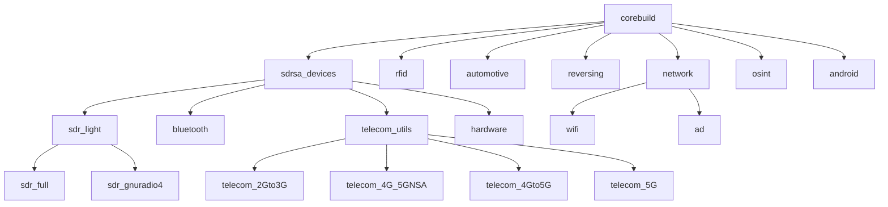

# 🚀 RF Swift 📡

<div align="center">
  
  <br><br>
  
  
  
  
  <br>
  
  
  
  <br><br>
  
  
  <br><br>
   <a target="_blank" rel="noopener noreferrer" href="https://www.blackhat.com/eu-24/arsenal/schedule/index.html#rf-swift-a-swifty-toolbox-for-all-wireless-assessments-41157" title="Schedule">
   
  </a>
  <a target="_blank" rel="noopener noreferrer" href="https://spectrum-conference.org/24/schedule" title="Schedule">
   
  </a>
  <a target="_blank" rel="noopener noreferrer" href="https://fosdem.org/2025/schedule/event/fosdem-2025-4301-rf-swift-a-swifty-toolbox-for-all-wireless-assessments/" title="Schedule">
   
  </a>
  <a target="_blank" rel="noopener noreferrer" href="https://www.cyberonboard.org/en/content/sujetsscientifiques" title="Schedule">
   
  </a>
  <a target="_blank" rel="noopener noreferrer" href="https://www.prasec.cz/index.html#topics" title="Schedule">
   
  </a>
  <br><br>
  <a target="_blank" rel="noopener noreferrer" href="https://x.com/intent/follow?screen_name=FlUxIuS" title="Follow"></a>
  <a target="_blank" rel="noopener noreferrer" href="https://x.com/intent/follow?screen_name=Penthertz" title="Follow"></a>
  <br><br>
  <a target="_blank" rel="noopener noreferrer" href="https://discord.gg/NS3HayKrpA" title="Join us on Discord"></a>
  <br><br>
</div>


https://github.com/user-attachments/assets/518c5045-4380-48d0-a731-6ec0273a02c5


## 🔍 What is RF Swift?

RF Swift builds you a **complete hardware and RF security lab in seconds** - on the machine you already use. 🔄 From a ham shack on a Sunday afternoon to a full James Bond-grade engagement on Monday morning: same tool, different image.

Unlike traditional approaches that force you to sacrifice your primary OS, RF Swift brings **200+ containerized RF, hardware and security tools** to your existing environment - on Linux, Windows and macOS, across x86_64, ARM64 and RISC-V64. 🏠

> **🆕 v3.0.0 "Resonance"** - images rebased on **Ubuntu 26.04 "Resolute"**, CLI rebuilt on the new **Moby SDK**, and new **`ad`**, **`android`** and **`osint`** images for full engagements. See [What's new in v3.0.0](#-whats-new-in-v300-resonance).

### ⚡ Why RF Swift Outperforms Dedicated OS Solutions

| Feature | RF Swift | Dedicated OS |
|---------|---------|------------------------------|
| **🏠 Host OS Preservation** | ✅ Keep your existing OS | ❌ Requires dedicated partition or VM |
| **🛡️ Tool Isolation** | ✅ Tools contained without system impact | ❌ Tools can destabilize system |
| **⚡ Deployment Speed** | ✅ Seconds to deploy | ❌ Hours for full installation |
| **💾 Disk Space** | ✅ Only install tools you need | ❌ Requires 20-50GB minimum |
| **🔄 Updates** | ✅ Update individual tools without risk | ❌ System-wide updates can break functionality |
| **🌐 Multi-architecture** | ✅ x86_64, ARM64, RISCV64 and more! | ❌ Limited architecture support |
| **🔁 Reproducibility** | ✅ Identical environments everywhere | ❌ System drift between other installations |
| **💼 Work Environment** | ✅ Use alongside productivity tools | ❌ Switch contexts between systems |
| **📹 Session Recording** | ✅ Built-in recording for documentation | ❌ Manual setup required |
| **🎨 Easy Customization** | ✅ Simple YAML recipes for custom images | ❌ Complex OS modifications |

## 🆕 What's new in v3.0.0 "Resonance"

### 📦 New base: Ubuntu Noble → Resolute (26.04)

Every official image (`penthertz/rfswift_resolute:*`) now runs on Ubuntu 26.04. This was the heaviest part of the release: GCC 15 promoted long-tolerated K&R C patterns to hard errors, CMake 4 dropped compatibility with `cmake_minimum_required(VERSION < 3.5)`, Boost 1.90 removed the `io_context` APIs much of the SDR ecosystem depends on, and Python 3.14 / Java 25 became the defaults.

Rather than pinning an old base, we patched the software and maintain the forks publicly, so **50+ GNU Radio out-of-tree modules build on a current LTS again**:

`gr-osmosdr` · `gr-gsm` · `gr-fosphor` · `gr-dvbs2` · `gr-nordic` · `gr-grnet` · `gr-pdu_utils` · `gr-sandia_utils` · `gr-fhss_utils` · `gr-timing_utils` · `srsRAN 4G` · `YATE` · `OpenBTS` · `OpenBTS-UMTS`

`OpenBTS` and `OpenBTS-UMTS` are legacy C++ that GCC 15 rejects outright; both are maintained on the `resolute` branches of our forks.

### 📡 Telecom: 5G SA now runs on OCUDU

The 5G SA stack shipped in the telecom images has moved from srsRAN Project to **[OCUDU](https://gitlab.com/ocudu/ocudu)** as the CU/DU stack. srsRAN 4G (and the 4G/5G-NSA path) still ships from our patched `srsRAN_4G_resolute` fork, so 2G through 5G remains one pull.

### ⚡ GNU Radio 4, testable in seconds

Want to try GNU Radio 4 without building it from source or risking your working 3.10 install? There's now a dedicated image - your existing setup stays untouched:

```bash
rfswift run -i penthertz/rfswift_resolute:sdr_gnuradio4
```

### ⚙️ Rebuilt CLI

- Container operations moved from the legacy Docker Go client to the **new Moby SDK** (`moby/moby/api` + `moby/moby/client`)
- Full Go dependency tree brought up to date
- **Dependabot**, a **module-audit** workflow and **security scanning** in CI
- **Signed build attestations** published with every release

### 🧰 New images for full engagements

| Image | What it covers |
|---|---|
| 🏛 `ad` | Active Directory assessments |
| 📱 `android` | Mobile app testing and instrumentation |
| 🕵️ `osint` | Open-source intelligence and recon |
| ⚡ `sdr_gnuradio4` | GNU Radio 4, ready to run (see above) |

Plus new tooling inside the existing images - SAST/DAST in `reversing` (Semgrep, Joern, cppcheck, honggfuzz, clang static analyzer, Trivy), `grimoire` in the shell harness, and WhisperPair (CVE-2025-36911) and `caeruleus` on the RF/Bluetooth side.

## ✨ Key Features

### Core Capabilities
- **🏠 Non-disruptive Integration**: Run specialized RF tools while continuing to use your preferred OS for daily work
- **🧩 Modular Tool Selection**: Deploy only the tools you need, when you need them
- **🛡️ Containerized Isolation**: Prevent RF tools from affecting system stability or security
- **🌍 Cross-platform Compatibility**: Works seamlessly on Linux, Windows, and macOS
- **🔌 Dynamic Hardware Integration**: Connect and disconnect USB devices, ports, capabilities, and resources without recreating containers
- **🌐 NAT Networking**: Isolated container networks with configurable subnets for multi-container RF lab setups
- **📋 Container Profiles**: YAML presets for quick deployment of preconfigured container environments
- **⚡ GPU Acceleration**: Dedicated images with OpenCL support for Intel and NVIDIA GPUs
- **💾 Space Efficiency**: Use a fraction of the disk space required by dedicated OS solutions

### 🐳🦭 Container Engine Support

RF Swift supports **Docker, Podman and Lima** as container engines, and (new in v4.0.0) a **Nix** engine that installs the tools natively instead of in a container. Choose the runtime that best fits your environment:

| | Docker | Podman | Lima |
|---|---|---|---|
| **Architecture** | Client-server daemon | Daemonless, fork-exec | Docker inside QEMU VM |
| **Root required** | Yes (daemon runs as root) | No (rootless by default) | No (VM managed by Lima) |
| **USB passthrough** | Linux; Windows via usbipd + WSL 2 | Linux; Windows via usbipd + WSL 2 | macOS via QMP hot-plug |
| **Best for** | Broad ecosystem, Windows/macOS | Security-focused, air-gapped | macOS + USB RF hardware |

#### Auto-detection

RF Swift **automatically detects** the available container engine at startup. If both are installed, Docker is used by default. Override with:

```bash
rfswift --engine podman run -n mycontainer -i penthertz/rfswift_resolute:sdr_light
rfswift --engine docker run -n mycontainer -i penthertz/rfswift_resolute:sdr_light
rfswift --engine lima run -n mycontainer -i penthertz/rfswift_resolute:sdr_light  # macOS USB
```

#### Podman support example

https://github.com/user-attachments/assets/14b6d50f-5250-420e-94e4-474991113372

#### Podman Highlights

- **Rootless containers**: No daemon, no root - ideal for locked-down environments and shared lab machines
- **OCI-compatible images**: All existing RF Swift images work out of the box with Podman
- **Seamless device passthrough**: USB SDR dongles, serial adapters, and GPUs work with both engines


- **Automatic cgroup handling**: RF Swift detects cgroup v1/v2 and configures device access rules accordingly

### ❄️ Nix engine (native environments)

New in v4.0.0. Instead of a container, the Nix engine installs an RF Swift tool set straight onto the host as a reproducible, pinned environment. No daemon, no container boundary, so USB radios and audio work with zero device plumbing. The environments (`sdr_light`, `rfid`, `wifi`, ...) are defined in the companion repo [RF-Swift-nix](https://github.com/PentHertz/RF-Swift-nix).

```bash
rfswift run --engine nix                       # interactive wizard
rfswift run --engine nix -i sdr_light -n mysdr # or the full command
rfswift exec --engine nix -c mysdr             # re-enter it

rfswift nix catalog                            # browse available environments
rfswift nix list                               # environments you created
rfswift env update --check mysdr               # preview pinned input updates
rfswift env update --input nixpkgs mysdr       # update nixpkgs and safely rebuild
rfswift env rebuild mysdr                      # rebuild without changing flake.lock
rfswift env generations mysdr                  # list rollback points
rfswift env rollback mysdr                     # restore the previous closure
```

Requires a [Nix](https://nixos.org/download) install with flakes (Linux and macOS; on Windows use WSL2). Full guide: [docs/nix-engine.md](docs/nix-engine.md).

### 🦙 macOS USB Passthrough (Lima)

Docker Desktop and Podman on macOS **cannot forward USB devices** (SDR dongles, HackRF, RTL-SDR, etc.) into containers. RF Swift solves this with **Lima**, which runs a QEMU VM with USB hot-plug support:

```bash
# Install QEMU + official Lima (USB passthrough works via the VM's video.display)
brew install qemu lima

# Attach your SDR dongle to the Lima VM
rfswift macusb list                              # see host USB devices
rfswift macusb attach --vid 0x1d50 --pid 0x604b  # forward HackRF to VM

# Run container via Lima's Docker (where USB device lives)
rfswift --engine lima run -i penthertz/rfswift_resolute:sdr_light -n sdr_work

# When done, detach
rfswift macusb detach --vid 0x1d50 --pid 0x604b
```

Lima auto-creates the VM on first use with Docker, USB libraries, kernel modules, and udev rules for all supported RF hardware pre-configured. Use `--engine lima` when you need USB devices; use Docker Desktop normally for everything else.

#### 🎮 GPU acceleration on Apple Silicon (opt-in)

On Apple Silicon, **USB passthrough and GPU acceleration need different VM backends and cannot coexist in one VM**. The Lima VM above uses QEMU for USB/SDR devices. For GPU compute (e.g. Vulkan-accelerated ML/DSP) there is a separate opt-in profile that uses the **krunkit** backend (libkrun), which exposes the Apple GPU to containers as a **Vulkan** device (Mesa Venus -> MoltenVK -> Metal). It is **Vulkan, not CUDA**, and provides **no** USB passthrough.

```bash
# One-time: install Lima + the krunkit backend
brew install lima
brew tap slp/krunkit && brew install krunkit

# Run a container in the GPU VM (auto-created on first use). --gpu implies --engine lima
# and uses a separate instance (rfswift-gpu), leaving your USB/SDR VM untouched.
rfswift --gpu run -i penthertz/rfswift_resolute:sdr_light -n gpu_work --devices /dev/dri
```

Use `--gpu` for GPU compute; use `--engine lima` (without `--gpu`) for SDR hardware. Requires macOS ≥ 14 and a guest kernel with virtio-gpu Venus support (Linux ≥ 6.13).

### 🪟 Windows install (one-click MSI + dependency bundle)

Two Windows deliverables ship with each release:

- **`RFSwift-Setup-<version>-<arch>.exe`** (x64 + arm64) — a bundle that installs, under a **single** UAC prompt, the prerequisites you pick on one screen: **WSL 2 + WSLg**, **usbipd-win** (USB/SDR passthrough), a **container engine** (Docker Desktop by default, or Podman Desktop, or "I already have one"), an optional **Nix in WSL 2** for native environments, and RF Swift itself. Everything already present is skipped.
- **`RFSwift-<version>-<arch>.msi`** (x64 + arm64) — RF Swift on its own (CLI on `PATH`, an "RF Swift Console" and "RF Swift Workbench" in the Start Menu), for enterprise deployment (Intune/GPO) or machines that already have the prerequisites.

After it runs, `rfswift` works from any console and the Workbench opens from the Start Menu. Details, silent-install switches and the trust model: [docs/windows-installer.md](docs/windows-installer.md).

### 🪟 Windows USB Passthrough (usbipd + WSL 2)

On Windows, Docker Desktop and Podman run their containers inside the WSL 2 VM, which cannot see the host USB bus. RF Swift forwards devices into that VM with [usbipd-win](https://github.com/dorssel/usbipd-win) (`winget install usbipd`). Only *sharing* a device for the first time needs administrator rights; RF Swift asks for them through a normal UAC prompt for `usbipd.exe`, once per device. Attaching and detaching never need elevation.

```powershell
rfswift usb status                     # usbipd-win, WSL 2 distribution, shared devices
rfswift usb list                       # host devices with their usbipd state
rfswift usb attach                     # picker: shares (UAC, once) then attaches to WSL 2
rfswift usb attach --busid 2-3         # or by bus ID; --yes allows the UAC prompt in scripts
rfswift run -i penthertz/rfswift_resolute:sdr_light -n sdr_work   # sees /dev/bus/usb
rfswift usb detach --busid 2-3         # give the device back to Windows
```

`rfswift run` offers the same picker when it detects shared or known RF hardware, and the Workbench exposes it as **USB passthrough...** on Docker/Podman missions. A forwarded device is visible to every WSL 2 distribution, including Docker Desktop's, because they share one kernel.

Inside the container, `/dev/bus/usb` must be mapped **and** USB device major 189 allowed (`c 189:* rwm`) - both are part of the RF Swift defaults. A bind mount alone lists the devices but cannot open them, and **privileged mode is not required**; `rfswift run` and the Workbench mission form check this before creating the container and tell you what is missing.

#### 🔊 Sound and display on Windows (WSLg)

No PulseAudio install and no `rfswift host audio enable` on Windows: WSLg already runs an X11 server and a PulseAudio server for the WSL 2 VM, and RF Swift mounts its `/mnt/wslg` tree into every container with `DISPLAY=:0` and `PULSE_SERVER=unix:/mnt/wslg/PulseServer`. GQRX, SDR++ and friends play through your Windows audio device. If `rfswift doctor` cannot find the WSLg sockets, run `wsl --update` followed by `wsl --shutdown`.

#### Quick Setup

```bash
# Install with the interactive installer (offers Docker, Podman, or both)
curl -fsSL "https://raw.githubusercontent.com/PentHertz/RF-Swift/refs/heads/main/scripts/get_rfswift.sh" | sh

# Or install Podman manually
sudo apt install podman          # Debian/Ubuntu
sudo dnf install podman          # Fedora/RHEL
sudo pacman -S podman            # Arch Linux
brew install podman              # macOS
```

The installer prefers the native packages automatically (deb/rpm/pacman on Linux, the signed Homebrew cask on macOS) and falls back to a tarball install; set `RFSWIFT_PKG_FORMAT=native|tarball` to pick non-interactively. The same packages - `rfswift` (CLI/TUI, with man pages and bash/zsh/fish completions) and `rfswift-workbench` (desktop GUI) - can also be installed manually from the [releases page](https://github.com/PentHertz/RF-Swift/releases):

```bash
sudo apt install ./rfswift_<version>_amd64.deb            # Debian/Ubuntu
sudo dnf install ./rfswift-<version>-1.x86_64.rpm         # Fedora/RHEL
sudo pacman -U rfswift-<version>-1-x86_64.pkg.tar.zst     # Arch Linux
```

On macOS, Homebrew installs the CLI and the Workbench GUI together from the signed release, and the bundled setup command picks your engine:

```bash
brew install --cask penthertz/rfswift/rfswift
curl -fsSL "https://raw.githubusercontent.com/PentHertz/RF-Swift/main/scripts/setup-macos.sh" | bash
```

> **Verifying downloads**: The installer offers to check each binary's Sigstore-backed **build provenance attestation** automatically. To verify manually with the [GitHub CLI](https://cli.github.com): `gh attestation verify <downloaded.tar.gz> --repo PentHertz/RF-Swift`. This proves the artifact was built by the official RF Swift release workflow from a specific commit - not swapped afterwards.

> **Note**: When using Podman in rootless mode, some operations (like direct device passthrough) may require additional configuration. RF Swift handles most of this automatically, but see the [documentation](https://rfswift.io/docs/guide/) for details.

## 🎬 Demo Videos

### 🐧 On Linux
https://github.com/PentHertz/RF-Swift/assets/715195/bb2ccd96-b688-4106-8fba-d82f84ff1ea4

### 🪟 On Windows (With GQRX)
https://github.com/PentHertz/RF-Swift/assets/715195/25a4a857-aa5a-4daa-9a08-28fa53d2f799

### 🖥️ Using OpenCL with Intel or NVIDIA GPU


## 📦 Available Specialized Images

RF Swift's container approach allows for specialized environments optimized for specific tasks. All images are **OCI-compatible** and work with both **Docker and Podman**.


```mermaid
graph TD;
    A[corebuild]-->B[sdrsa_devices];
    A-->C[rfid];
    A-->D[automotive];
    A-->E[reversing];
    A-->H[network];
    A-->T[osint];
    A-->U[android];
    B-->I[sdr_light];
    B-->J[bluetooth];
    B-->K[telecom_utils];
    B-->L[hardware];
    H-->M[wifi];
    H-->V[ad];
    I-->N[sdr_full];
    I-->W[sdr_gnuradio4];
    K-->P[telecom_2Gto3G];
    K-->Q[telecom_4G_5GNSA];
    K-->R[telecom_4Gto5G];
    K-->S[telecom_5G];
```

| Category | Images | Key Tools |
|----------|--------|-----------|
| 📻 **SDR** | `sdr_light`, `sdr_full`, `sdr_gnuradio4` 🆕 | GNU Radio (3.10 + a dedicated GNU Radio 4 image), GQRX, SDR++, SDRangel, SigDigger, CyberEther, Inspectrum, URH, rtl_433, dump1090, GNSS-SDR, SatDump, Jupyter + 50+ GNU Radio OOT modules (gr-gsm, gr-lora, gr-satellites, gr-ieee802-11, gr-droneid, gr-tempest, ...) |
| 📡 **SDR Devices** | `sdrsa_devices` | Drivers for USRP (UHD), RTL-SDR, HackRF, BladeRF, Airspy, LimeSDR, PlutoSDR, XTRX, RFNM, HydraSDR, LiteX M2SDR, SignalHound, Harogic, LibreSDR, SoapySDR |
| 📱 **Telecom** | `telecom_utils`, `telecom_2Gto3G`, `telecom_4G_5GNSA`, `telecom_4Gto5G`, `telecom_5G` | PySIM, pycrate, srsRAN 4G, **OCUDU** 🆕 (5G SA CU/DU), Open5GS, UERANSIM, YateBTS, OpenBTS, OpenBTS-UMTS, OsmoCom BTS Suite, SigPloit, PyHSS, SCAT, jSS7, 5Greplay |
| 📶 **Bluetooth** | `bluetooth` | BlueZ, WHAD, Mirage, Sniffle, Bluing, bdaddr, ice9-bluetooth, esp32 BT Classic sniffer |
| 📡 **Wi-Fi** | `wifi` | Aircrack-ng, hcxdumptool, Reaver, Bully, Pixiewps, EAPHammer, Airgeddon, Wifite2, WPA3 attack suite (Dragonslayer/Dragonforce/Wacker), Hostapd-mana, Wifiphisher |
| 🏷️ **RFID** | `rfid` | Proxmark3 (RRG/Iceman), libnfc, mfoc, mfcuk, RFIDler, miLazyCracker |
| 🚗 **Automotive** | `automotive` | can-utils, CANtact, Caring Caribou, SavvyCAN, Gallia, V2GInjector |
| 🔧 **Hardware** | `hardware` | PulseView, DSView, Logic 2 (Saleae), Arduino IDE, Flashrom, OpenOCD, esptool, openFPGALoader, MTKClient, ngscopeclient, dfu-util, SeerGDB, AVRDUDE |
| 🔍 **Reversing & SAST** | `reversing` | Ghidra, Radare2, Cutter, ImHex, Binwalk (v2+v3), Unblob, Sasquatch, AFL, Honggfuzz, Kaitai Struct, Qiling, Unicorn/Keystone, plus SAST/DAST: Semgrep, Joern, cppcheck, clang static analyzer, Trivy 🆕 |
| 🌐 **Network** | `network` | Nmap, Wireshark, Metasploit, Burp Suite, Caido, Impacket, NetExec, Responder, Hashcat, John the Ripper, Kismet, Bettercap, SIPVicious, MBTget |
| 🏛 **Active Directory** 🆕 | `ad` | Impacket, NetExec, Responder, BloodHound.py, Certipy, bloodyAD, certsync, mitm6, kerbrute, lsassy, ldapdomaindump, sprayhound, DonPAPI, SharpLAPS, skewrun |
| 📱 **Mobile** 🆕 | `android` | adb/fastboot, apktool, apksigner, zipalign, smali, scrcpy, dex2jar, Frida, objection, androguard, drozer, MobSF |
| 🕵️ **OSINT** 🆕 | `osint` | theHarvester, Sherlock, maigret, holehe, GHunt, toutatis, instaloader, Sublist3r, h8mail, censys, SpiderFoot, recon-ng, FinalRecon |

> **200+ tools** across 18+ images, all on **x86_64**, **ARM64**, and **RISC-V64**.

Full image list with detailed tool inventory available at [rfswift.io/docs/guide/list-of-tools/](https://rfswift.io/docs/guide/list-of-tools/)

## 🌟 Real-World Use Cases

### 👔 For Professionals

- **🧰 Rapid Assessment Deployment**: Deploy a complete RF lab at client sites in minutes
- **🔄 Consistent Environments**: Eliminate "works on my machine" issues
- **⚙️ Parallel Testing**: Run multiple isolated assessments simultaneously
- **📹 Documentation**: Built-in session recording for client reports
- **🛠️ Custom Toolsets**: Create specialized containers for specific engagements

### 🔬 For Researchers

- **📊 Reproducible Research**: Share exact tool environments with papers
- **🧪 Experiment Isolation**: Keep experimental configurations separate
- **🌐 Multi-platform Collaboration**: Work across Linux, Windows, and macOS
- **🔢 Version Control**: Test with specific tool versions for reproducibility
- **⚡ Resource Optimization**: Allocate resources based on research needs

### 👨‍🏫 For Educators

- **🏫 Classroom Deployment**: Identical environments for all students
- **💻 No OS Reinstall**: Students keep their existing operating systems
- **🖥️ Low Requirements**: Works on standard lab computers
- **📚 Focused Learning**: Custom containers for specific lessons
- **🔄 Quick Reset**: Easily reset environments between classes

### 🏭 For Manufacturing & QA

- **🔍 Production Testing**: Consistent RF testing environments
- **📡 Device Validation**: Test wireless product compliance
- **🔧 Firmware Analysis**: Isolated environments for firmware testing
- **📊 Quality Assurance**: Reproducible test configurations

### 🔒 For Security-Conscious Environments

- **🦭 Rootless with Podman**: No privileged daemon required - ideal for SOC-compliant and hardened systems
- **🏔️ Air-gapped labs**: Pre-pull images, deploy without internet using Podman's daemonless architecture
- **🛡️ Minimal attack surface**: No long-running daemon socket to protect

## 📖 Documentation

Comprehensive documentation is available at [rfswift.io](https://rfswift.io/), including:

- 🚀 [Getting Started Guide](https://rfswift.io/docs/getting-started/)
- 🏁 [Quick Start Tutorial](https://rfswift.io/docs/quick-start/)
- 📘 [User Guide](https://rfswift.io/docs/guide/)
- 📝 [YAML Recipe Guide](https://rfswift.io/docs/development/yaml-recipe-guide/)
- 👨‍💻 [Development Documentation](https://rfswift.io/docs/development/)
- 🧰 [List of Included Tools](https://rfswift.io/docs/guide/list-of-tools/)
- 🛡️ [Security Guidelines](https://rfswift.io/docs/security/)
- 🔐 [Remote agent setup and paranoid security model](docs/remote-agent.md)
- 🍎 [macOS signed DMG: Developer ID signing and notarization](docs/macos-signing.md)

## 🎓 Training & Workshops

RF Swift is used in professional training courses by Penthertz:
- 📻 Software Defined Radio assessments
- 📱 Mobile network security testing
- 🚗 Automotive security analysis
- 🏭 IoT and embedded device testing

[Contact us](https://penthertz.com/) for custom training programs.

## 👥 Community & Support

- 💬 [Join our Discord](https://discord.gg/NS3HayKrpA) for community support and discussions
- 🐛 [Report issues](https://github.com/PentHertz/RF-Swift/issues) on GitHub
- 💡 [Request features](https://github.com/PentHertz/RF-Swift/discussions) via GitHub Discussions
- 🐦 Follow us on X (Twitter): [@FlUxIuS](https://x.com/FlUxIuS) and [@Penthertz](https://x.com/Penthertz)
- 📧 Professional inquiries: [penthertz.com](https://penthertz.com/)

## 🤝 Contributing

We welcome contributions! Here's how you can help:

### Code Contributions
- 🧰 **Tool Integration**: Add new tools or improve existing ones
- 🐞 **Bug Fixes**: Submit PRs to fix reported issues
- ✨ **New Features**: Implement new capabilities
- 📝 **Documentation**: Improve guides and examples

### Community Contributions
- 📝 **YAML Recipes**: Share your custom image recipes
- 🎓 **Tutorials**: Create guides for specific tools or workflows
- 🐛 **Bug Reports**: Report issues you encounter
- 💡 **Feature Requests**: Suggest improvements

### Getting Started with Contributing

1. Fork the repository
2. Create a feature branch (`git checkout -b feature/amazing-feature`)
3. Commit your changes (`git commit -m 'Add amazing feature'`)
4. Push to the branch (`git push origin feature/amazing-feature`)
5. Open a Pull Request

## ⚖️ License

RF Swift is released under the GNU General Public License v3.0. See [LICENSE](LICENSE) file for details.

## 🙏 Acknowledgments

Special thanks to:
- All contributors and clients who have helped improve RF Swift
- The open-source RF and security tool developers whose work we integrate
- The community for feedback, bug reports, and feature requests
- Conference organizers who have hosted our presentations
