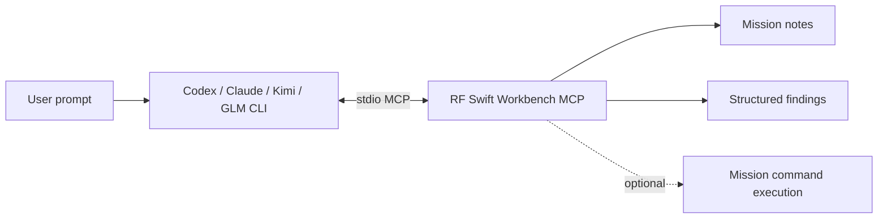

# RF Swift coding-agent integration (optional MCP)

RF Swift does not call a model API, select a model, store provider API keys, or
charge for AI usage. Instead, the Workbench exposes an optional local MCP server
to an external coding-agent CLI such as Codex, Claude Code, Kimi Code, or GLM.
That CLI owns its authentication, subscription, model choice, and billing.



## Security model

The bridge is disabled by default and uses local standard input/output, so RF
Swift does not open an MCP network port. Each invocation can be restricted to a
single project and mission. Permissions are independent:

- Read-only exposes mission discovery, notes, and findings.
- Write access additionally exposes `write_note` and `save_finding`.
- Command access additionally exposes `execute_command` inside the mission
  target. This is disabled by default and should only be enabled for an
  authorized assessment.

Tools that are not permitted are omitted from `tools/list`, not merely rejected
after an agent tries them. Agent permissions are kept in the local RF Swift user
configuration and are not placed in exported projects; model credentials remain
entirely owned by the external client.

## Starting the server

For Codex, Claude Code, and Kimi Code, press **Connect & launch** in the Agent
panel. Workbench then:

1. Detects the selected CLI on `PATH`.
2. Creates or merges a private configuration under the mission's
   `agent-workspace` directory.
3. Performs a real MCP `initialize` handshake with the mission-scoped server.
4. Starts the client's interactive TUI in the embedded terminal.

While the TUI is connected, Workbench refreshes mission notes and findings
written by MCP so changes appear in their panels without switching missions.
The generated `AGENTS.md`/`CLAUDE.md` tells clients that phrases such as
"create a note" mean the mission `write_note` tool, not a loose file in the
launcher directory.

When an agent calls `execute_command`, Workbench opens a read-only **AI · tool**
terminal tab automatically. It displays the requested command immediately,
streams its real container or Nix output, and marks the final success/failure
state. This makes agent activity visible without mixing it into an operator's
interactive shell tab.

## Ground-truth AI audit

**Audit with AI** in the Security posture panel is deliberately a two-stage
workflow:

1. Workbench runs the deterministic Nix or container scanners and persists their
   unmodified JSON report as the mission's ground truth.
2. The connected agent reads that evidence with `read_audit`, consults
   `recommend_tools`, and may perform authorized non-destructive corroboration.

The agent is instructed to separate verified findings from hypotheses, never
invent CVEs, versions, output, exploitability, or CVSS metrics, and only save a
finding when scanner or observed command evidence supports it. Scanner severity
is retained as upstream evidence, but it is not presented as confirmed mission
exploitability. Runtime posture excludes build-time-only dependency matches;
those remain visible as supply-chain leads that require a demonstrated runtime
or release pathway. Nix vulnix
reports embed each matched CVE with its package, installed version, derivation,
score, severity, and description so the AI and GUI can cite the actual evidence
instead of relying on aggregate counts.

This audit concerns only the Nix closure or container image used as the RF
Swift tool environment. It is stored under `environment-audits/` and is never
included in mission finding totals or PwnDoc exports. Mission findings are
operator-validated vulnerabilities or bugs in the assessed IoT/RF target.
Environment CVEs cannot be promoted automatically into those findings.

From the Findings panel, **Suggest from evidence** asks the connected agent to
review all mission Markdown notes and registered artifact metadata through
`read_evidence_index`. It produces source-cited candidates for operator review;
it does not silently save findings, and artifact metadata alone is not treated
as proof of a vulnerability.

The client can still show its normal workspace-trust and tool-approval prompts.
Disconnecting closes the TUI and its MCP child process. The project-local files
remain so the next launch is reproducible. Claude uses `.mcp.json`, Kimi uses
`.kimi-code/mcp.json`, and Codex uses `.codex/config.toml`.

The Agent panel also displays the exact command for manual integration with any
other stdio MCP client. The general form is:

```bash
rfswift-workbench --mcp --workspace PROJECT --mission MISSION
```

Optional flags are `--mcp-write` and `--mcp-exec`. Register that command as a
stdio MCP server named `rfswift`, then use the mission prompt from the panel.

## MCP tools

| Tool | Permission | Purpose |
|---|---|---|
| `recommend_tools` | read | Suggest RF-Swift programs, environments, and example commands for a task or artifact |
| `read_audit` | read | Read the latest deterministic scanner report used as ground truth for AI-assisted review |
| `read_evidence_index` | read | Read mission notes and registered artifact metadata for evidence-cited finding candidates |
| `list_missions` | read | List missions visible in the project/scope |
| `read_note` | read | Read a mission Markdown note |
| `list_findings` | read | Read PwnDoc-compatible structured findings |
| `write_note` | write | Replace or append to a Markdown note |
| `save_finding` | write | Create or replace a structured finding |
| `execute_command` | execute | Run a command in the selected mission target |

Editor AI actions now prepare a scoped prompt and copy it for the external agent;
they never send document contents to a provider directly.
