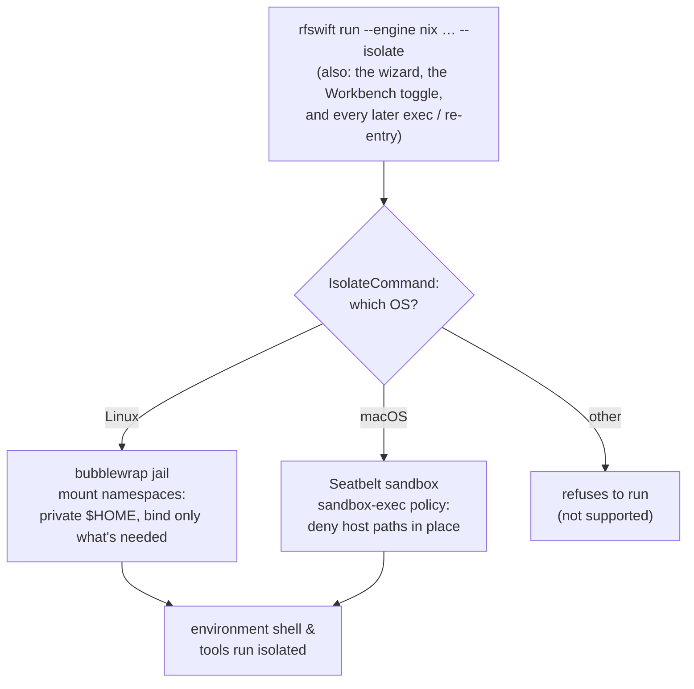
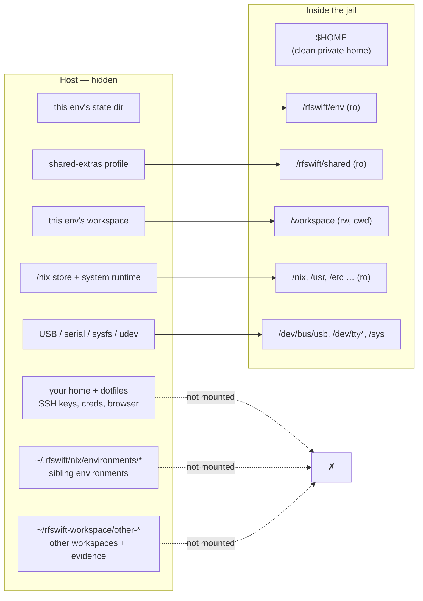
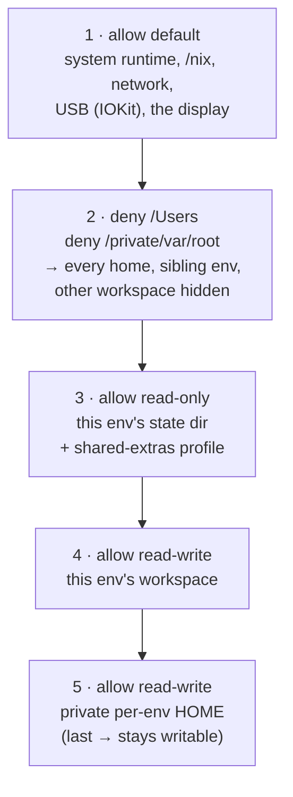
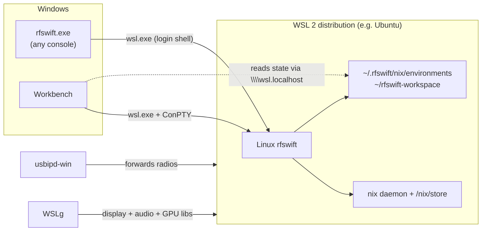

# The Nix engine (RF Swift v4.0.0)

RF Swift v4.0.0 adds a fourth engine alongside Docker, Podman and Lima: **Nix**.

Where the container engines run your tools inside an image, the Nix engine installs
them straight onto the host as a reproducible, pinned environment. There is no
daemon and no container boundary, so USB radios and audio work without any device
or socket plumbing. The tool sets are the same ones the Docker images ship
(`sdr_light`, `rfid`, `wifi`, ...), defined in the companion repository
[RF-Swift-nix](https://github.com/PentHertz/RF-Swift-nix).

## Requirements

A working [Nix](https://nixos.org/download) install with flakes. The multi-user
install is recommended:

```bash
sh <(curl -L https://nixos.org/nix/install) --daemon
```

RF Swift enables the `nix-command` and `flakes` features on every call, so you do
not need to edit `nix.conf`.

On **Windows**, Nix runs inside a WSL 2 distribution that RF Swift provisions
and drives for you: see [Windows: the engine runs in WSL 2](#windows-the-engine-runs-in-wsl-2).

## Quick start

```bash
# Interactive wizard: pick an environment, name it, choose a workspace
rfswift run --engine nix

# Or the full command
rfswift run --engine nix -i sdr_light -n mysdr

# Re-enter it later
rfswift exec --engine nix -c mysdr

# Run a one-off command in it
rfswift exec --engine nix -c mysdr -e "gqrx"
```

`RFSWIFT_ENGINE=nix` works too, so you can set it once for a shell session.

## Managing environments

```bash
rfswift nix catalog                 # environments you can create
rfswift nix list                    # environments you have created
rfswift nix info mysdr              # details + package list for one environment
rfswift nix tools mysdr             # on-demand shims and installed extras of one environment
rfswift nix search hackrf           # find a tool (add --nixpkgs for the whole pinned nixpkgs)
rfswift nix remove mysdr           # delete it (frees the pin; nix store gc reclaims space)
rfswift nix run sdr_light gqrx     # build and run a single tool on demand
```

`list`, `info`, `tools`, `search`, `generations`, `gl` and `udev --list` accept
`--json` for scripts (and for the Windows front end, see below).

The newer resource-first spelling is `rfswift env ...`; `rfswift nix ...`
remains compatible and prints a deprecation notice.

## Updating, rebuilding and rolling back

Check whether the pinned flake inputs have changed without modifying anything:

```bash
rfswift env update --check mysdr
```

Run the command without a name to open the guided update wizard:

```bash
rfswift env update
```

The wizard provides a searchable environment picker, lets you check only,
update every input, or select one input from the environment's real
`flake.lock`, displays a recap including existing rollback points, and asks for
confirmation before changing anything.

Update every input in the local `flake.lock`, then rebuild:

```bash
rfswift env update mysdr
# Non-interactive/CI:
rfswift env update --yes mysdr
```

Update only nixpkgs:

```bash
rfswift env update --input nixpkgs mysdr
```

`--input` requires a writable local flake checkout. A GitHub flake reference
has no local lock file to edit, so RF Swift can refresh and rebuild it but cannot
selectively rewrite one of its inputs.

To rebuild using the lock that is already pinned - without looking for newer
nixpkgs or GitHub revisions - run:

```bash
rfswift env rebuild mysdr
```

Updates and rebuilds are transactional for eager environments: prerequisites
and a candidate closure are built before the active profile changes. If the
build fails, the current environment remains active; after a failed local flake
update, the previous `flake.lock` is restored. A successful switch preserves
the former closure as a Nix GC root:

```bash
rfswift env generations mysdr
rfswift env rollback mysdr                    # newest previous generation
rfswift env rollback mysdr <listed-generation> # selected listed generation
```

Rollback generations are stored under
`~/.rfswift/nix/environments/<name>/generations/`, so `rfswift env gc` cannot
remove them. Updating invalidates the environment security audit while retaining
the old report as a stale report beside the environment metadata. Run
`rfswift env audit mysdr` again after updating.

These generation guarantees apply to eager environments. Lazy and pure
environments do not have a complete pinned profile to preserve; recreate them
as eager environments when transactional update and rollback are required.

The requested legacy-compatible forms are all available too:

```bash
rfswift nix update --check <name>
rfswift nix update --input nixpkgs <name>
rfswift nix rebuild <name>
rfswift nix generations <name>
rfswift nix rollback <name>
```

They behave identically to `rfswift env ...`; only a migration notice is
printed because `env` is the canonical resource-first command group.

## Build modes: all at once, or step by step

Creating an environment can work two ways:

- **Eager (default):** `rfswift run --engine nix -i sdr_light -n mysdr` builds the
  whole tool set once and pins it. The first run downloads the cached tools and
  compiles the few that are not cached; after that every entry is instant and
  works offline.
- **On-demand:** `rfswift run --engine nix -i sdr_light -n mysdr --lazy` does not
  prebuild anything. Each tool becomes a shim that builds it the first time you
  call it. Type `gqrx` and gqrx is built and run; type `inspectrum` next and only
  that is built. Nothing you never use is ever built. The interactive wizard also
  offers this as a "build mode" choice.

You can also run a single tool without creating an environment at all:

```bash
rfswift nix run sdr_light gqrx            # build+run gqrx from the pinned set
rfswift nix run mysdr inspectrum -- x.iq  # scoped to an environment's pinned flake
```

Both modes build the same tool from the same pinned definition, so results are
identical; the only difference is when the work happens.

## Guided installation of additional tools

Run the installer without a package name to open the wizard:

```bash
rfswift nix install
# Equivalent unified entry point:
rfswift --engine nix install
```

The wizard asks whether the package should be shared by every RF Swift Nix
environment or installed only for one environment, including lazy environments.
It can search either the curated RF Swift tool set or the complete pinned
`nixpkgs` package set. The selected package is added to a persistent profile and
appears on `PATH` when the relevant environment is entered.

For automation, the existing non-interactive form remains unchanged:

```bash
rfswift nix install ffmpeg
rfswift nix install gnuradioPackages.gr-foo --env mysdr
```

For containers, `rfswift install` with no arguments inspects `/root/scripts` in
the selected container and opens a searchable picker of available installer
functions. The function name does not need to be looked up in documentation.

### Downloading instead of compiling (binary cache)

"Build" mostly means "download a prebuilt binary from the Nix cache", not
"compile from source". Standard nixpkgs tools (GNU Radio, GQRX, Wireshark, ...)
are fetched prebuilt. Only tools not in a cache compile locally, which for RF
Swift is the handful of custom derivations in RF-Swift-nix/pkgs. If the project
publishes those to its own binary cache (the RF-Swift-nix CI does this), even
those download prebuilt and no local compilation is needed.

## How it works

- An **environment** is the Nix analogue of a container: created once, re-entered,
  removed. Each lives under `~/.rfswift/nix/environments/<name>/`.
- `run` resolves the image to a flake output, builds its tool closure with
  `nix build`, and pins it with a gcroot symlink (`.../<name>/profile`). The first
  build fetches and compiles; later entries are instant and work offline.
- Entering the environment starts your shell with the tools prepended to `PATH`
  and a workspace as the working directory (`~/rfswift-workspace/<name>/` by
  default; change with `--workspace`, `--cwd`, or `--no-workspace`). Natively
  the workspace is used in place at that host path; under
  [`--isolate`](#isolation---isolate) it is remapped to `/workspace` inside the
  jail.

## Flags specific to the Nix engine

| Flag | Meaning |
|------|---------|
| `--lazy` | On-demand: build each tool the first time it is called, not all up front |
| `--pure` | Enter a pure environment (`nix develop --ignore-environment`), not inheriting the host environment |
| `--isolate` | Enter inside a bubblewrap jail (Linux): hides `$HOME` and the host filesystem, keeps USB/serial devices, the display and the network. See [Isolation](#isolation---isolate). |
| `--rebuild` | Force re-realisation during creation (eager mode); for an existing environment use `rfswift env rebuild <name>` |
| `--create-only` | Create and realise the environment without entering it (scripts, the Workbench) |
| `--flake <ref>` | Use a specific flake reference instead of the default |

## Isolation (`--isolate`)

By default the Nix engine runs tools **natively**, as your user, with full access
to your home, files, network and devices. That is what makes it good at driving
real RF hardware, but it is not a sandbox: a vulnerable or untrusted tool has the
same reach you do. This is the opposite trade-off from the container engine
(Docker/Podman), which isolates by default. Nix's own build sandbox only protects
*builds*; it does nothing for a tool once it runs.

`--isolate` adds an optional, usability-preserving jail. The mechanism depends on
the OS — [bubblewrap](https://github.com/containers/bubblewrap) (unprivileged
Linux user namespaces) on Linux, the **Seatbelt sandbox** (`sandbox-exec`) on
macOS — but the guarantee is the same: your real `$HOME`, the rest of the host
filesystem, sibling environments and other workspaces are hidden, while `/nix`,
USB hardware, the display and the network stay reachable.

```bash
rfswift run --engine nix -i sdr_light -n mysdr --isolate
```

`IsolateCommand` picks the backend for the host it runs on; on an unsupported OS
it refuses rather than silently running unisolated:



The choice is also offered in the interactive wizard and as an **Isolate (jail)**
toggle in the Workbench create form. It is stored on the environment, so `exec`,
re-entry and the Workbench terminal all re-enter the same jail. You can also set
it per environment at creation time and forget about it.

### What the jail hides

- Your real `$HOME` and the rest of the host filesystem. Inside the jail `$HOME`
  is a private, per-environment directory (empty apart from what the tools
  create), so SSH keys, browser data, credentials and unrelated files are not
  visible.
- Host processes (**Linux only**): the shell gets its own PID/IPC/UTS namespaces.
  macOS's Seatbelt is a filesystem/capability policy, not a namespace, so process
  isolation is Linux-only — the data-hiding guarantee below is the same on both.
- Other RF Swift environments and **other workspaces**. Only *this* environment's
  state and *this* environment's workspace are exposed. A tool in one isolated
  session cannot read or tamper with another workspace's files or its captured
  **evidence** (recordings, artifacts).

### What the jail keeps (so tools still work)

- The `/nix` store and this environment's tools, on `PATH` as usual.
- **USB and serial devices** (`/dev/bus/usb`, `/dev/tty{USB,ACM,S}*`) plus
  `/sys` and `/run/udev`, so libusb and SDR/RFID tools still enumerate and open
  hardware. Verified with a HydraSDR: visible to `lsusb` and openable inside the
  jail.
- The X11/Wayland display and the network.

### Layout inside the jail

**Linux (bubblewrap)** binds only what the environment needs onto clean paths,
over an otherwise hidden host filesystem:



- `$HOME` - a clean, private per-environment home.
- `/workspace` - this environment's workspace (read-write), and the working
  directory.
- `/rfswift/env` - this environment's tools and state (read-only).
- `/rfswift/shared` - tools installed with the shared `rfswift env install`
  profile, if any (read-only).

So `ls $HOME` shows only what you create, `ls /workspace` shows your work, and
nothing from the host or from other environments leaks in.

**macOS (Seatbelt)** cannot bind-mount, so it does **not** remap paths: files
keep their real host locations and the sandbox simply denies access to
everything outside the allow-list. `$HOME` is redirected to the same private
per-environment directory, but the workspace, the env state and the shared
profile are reached at their **real paths**, not under `/workspace` or
`/rfswift/*`.

> **Workspace path differs by mode/OS.** On **Linux with `--isolate`** the
> workspace is remapped to **`/workspace`** inside the jail (its host location,
> `~/rfswift-workspace/<name>` by default, stays hidden). On **macOS with
> `--isolate`**, and **without** `--isolate` on either OS, there is no remap: the
> workspace is used **in place** at its real host path. So scripts that hard-code
> an absolute workspace path should use `/workspace` only under Linux `--isolate`
> (or, portably, a relative path / `$PWD`, which works everywhere).

### Requirements and limits

- **Linux and macOS.** Linux uses bubblewrap; macOS uses the built-in Seatbelt
  sandbox via `/usr/bin/sandbox-exec` (present on every macOS — nothing to
  install). On any other OS `--isolate` refuses to run rather than pretend to
  isolate.
- bubblewrap (**Linux**) is taken from your `PATH` (a setuid-root bwrap is preferred), or
  built from nixpkgs on first use. The installer (`get_rfswift.sh`) offers to
  install it alongside the Nix engine.
- **Unprivileged user namespaces** (**Linux**) must be available, unless bubblewrap is
  setuid-root. Ubuntu 24.04+ and recent Debian restrict them by default
  (AppArmor), so `--isolate` fails with a uid-map "permission denied" error. RF
  Swift preflights the sandbox and, on failure, tells you how to fix it; the
  installer offers to do it for you. To enable them yourself:

  ```bash
  sudo sysctl -w kernel.apparmor_restrict_unprivileged_userns=0
  sudo sysctl -w kernel.unprivileged_userns_clone=1   # older kernels
  # persist:
  echo -e 'kernel.apparmor_restrict_unprivileged_userns=0\nkernel.unprivileged_userns_clone=1' \
    | sudo tee /etc/sysctl.d/99-rfswift-userns.conf
  ```

  Installing a setuid bubblewrap is an alternative (it needs no unprivileged
  namespaces). You do not need `sudo` to *run* `--isolate` once either is in
  place.
- The network is kept by default, name resolution included: when
  `/etc/resolv.conf` is a symlink out of `/etc` (systemd-resolved,
  resolvconf, NetworkManager, WSL) its target is bound into the jail. This is
  a jail for your filesystem, processes and other workspaces, not a full
  security sandbox: treat untrusted tools with the usual care, and lean on
  `rfswift env audit` for supply-chain posture.
- **WSL 2** (the Nix engine on Windows): the jail works unchanged inside the
  distribution - unprivileged user namespaces are available and bubblewrap is
  built from nixpkgs on first use - and additionally binds WSLg's `/mnt/wslg`
  (display and sound sockets) and `/dev/dxg` (the virtual GPU) so GUI tools
  keep working. Verified: an isolated shell sees its own PID namespace, the
  private home, `/workspace`, the X11 and PulseAudio sockets, and can build
  an on-demand tool over the network.

### The macOS Seatbelt policy

macOS builds the jail as a Seatbelt (SBPL) profile handed to `sandbox-exec`.
SBPL is **last-match-wins**, so RF Swift starts from a working system, revokes
access to every user home, then re-grants exactly what the environment needs —
the private HOME rule comes last so it stays writable even though it lives under
the denied state dir:



Verified on macOS: a tool in the jail reading the real `$HOME` gets *Operation
not permitted*, while the private HOME, the workspace, `/nix` and the network
work normally. Because Seatbelt is a capability policy rather than a set of
namespaces, the process/PID isolation and the private `/tmp` that Linux provides
are not part of the macOS jail — the filesystem-hiding guarantee is identical.

## Windows: the engine runs in WSL 2

Nix has no Windows port, so on Windows the Nix engine lives inside a **WSL 2
distribution** and RF Swift drives it for you. Every command keeps the same
spelling: `rfswift run --engine nix`, `rfswift nix install`, `rfswift env
update`, ... typed in PowerShell or the RF Swift Console are served by the Linux
`rfswift` inside the distribution, with the same wizards, builds and shells.
The Workbench uses the same backend, so Nix missions appear there as on Linux.



### Setting it up

The Windows installer offers **Set up Nix in WSL 2**. Without it, or on a new
distribution, run:

```powershell
rfswift nix wsl setup            # systemd, Nix with flakes, the Linux rfswift CLI
rfswift nix wsl status           # what the distribution offers (nix, rfswift, WSLg, USB)
```

`setup` asks before each step (`--yes` answers for you), installs Ubuntu when no
WSL 2 Linux distribution exists (`wsl --install -d Ubuntu`; you create a Linux
user on first boot), enables systemd in `/etc/wsl.conf` so the nix daemon and
udev run as services, installs Nix with the Determinate Systems installer, and
puts the Linux `rfswift` in `/usr/local/bin` at the same version as the Windows
one (falling back to the latest release). Any Nix command that finds the
distribution unprovisioned offers the same setup. With several distributions,
`rfswift nix wsl use <name>` (or `RFSWIFT_WSL_DISTRO`) picks the one to use;
Docker Desktop's and Podman's utility VMs are never used. The Workbench's engine
doctor shows the same status and has a **Set up Nix in WSL 2** button.

### What lives where

- Environments, their profiles, audit reports and default workspaces are inside
  the distribution: `~/.rfswift/nix/` and `~/rfswift-workspace/<name>/` of your
  Linux user. Explorer reaches them at
  `\\wsl.localhost\<distro>\home\<user>\rfswift-workspace` (`rfswift nix wsl
  status` prints the exact path; `run` tells it when a workspace is created).
- A Windows path given to `--workspace`, `nix export -o`, `nix import` or
  `--flake` (a local RF-Swift-nix checkout) is translated to its `/mnt/<drive>/`
  view, so the environment's workspace can also be a folder of your Windows
  profile. Working on `/mnt/c` is slower than on the distribution's own disk.
- `RFSWIFT_ENGINE`, `RFSWIFT_NIX_FLAKE`, `RFSWIFT_NIX_GL`, `RFSWIFT_NIX_HOME` and
  `RFSWIFT_NIX_CATALOG` set on Windows are forwarded to the Linux side, which
  also receives `RFSWIFT_NO_BANNER=1` so only the Windows side prints the
  banner (the Linux CLI prints it on interactive terminals only anyway).
- The distribution is chosen from `RFSWIFT_WSL_DISTRO`, then `[nix] wsl_distro`
  in `config.ini`, then the default WSL 2 distribution.

### Hardware, display, sound and GPU

- **USB radios**: forward them into the WSL 2 kernel with `rfswift usb attach`
  (usbipd-win), exactly as for containers; `run`, `exec` and `shell` with the
  Nix engine offer the picker when they detect RF hardware, and the Workbench's
  **USB passthrough...** action is available on Nix missions. Every WSL 2
  distribution shares that kernel, so one attach serves containers and Nix
  environments alike. Inside the distribution the tools then see
  `/dev/bus/usb`, and the environment's **udev rules** apply there (systemd
  runs udev): `rfswift nix udev <name>`, or **Install device rules** in the
  Workbench, installs them as on a Linux host, with no password prompt (WSL
  grants root to your Windows user). Replug the device afterwards.
- **Display and sound** come from WSLg (`DISPLAY=:0`, PulseAudio), nothing to
  install. `rfswift doctor` and `rfswift nix wsl status` report both sockets.
- **OpenGL**: the environment's Mesa is used as on any non-NixOS host, with
  WSLg's GPU libraries (`/usr/lib/wsl/lib`, `libdxcore`) appended so Mesa's
  `d3d12` driver reaches your GPU through WSLg's virtual GPU; `rfswift nix gl
  <name> --check` tells whether the GPU or llvmpipe answered.
- `--isolate` works inside the distribution (bubblewrap, built from nixpkgs on
  first use).

### Keeping both sides aligned

The Windows `rfswift.exe` and the Linux `rfswift` should be the same version:
the front end tells you when they differ, and `rfswift nix wsl setup --update`
reinstalls the Linux one at the Windows version (or `--version <tag>`, or
`--binary <file>` for a local build). `rfswift nix wsl shell` opens a login
shell in the distribution when you want to work there directly.

## Choosing where environments come from

The flake reference is resolved in this order:

1. `--flake <ref>`
2. `RFSWIFT_NIX_FLAKE` (a flake URL or a local path)
3. a local `RF-Swift-nix` checkout next to the working directory or the binary
4. the published default, `github:PentHertz/RF-Swift-nix`

So if you clone RF-Swift-nix next to RF-Swift and hack on `environments.nix`, RF
Swift uses your local copy automatically.

## GUI tools and hardware on hosts that are not NixOS

### OpenGL for GUI tools (SDR++, gqrx, inspectrum, ...)

Programs from nixpkgs use nixpkgs' own Mesa and libglvnd, which look for GPU
drivers where NixOS installs them (`/run/opengl-driver`). On Ubuntu, Fedora,
Arch and the like that directory does not exist, so without help every OpenGL
tool fails the same way: `EGL: Failed to get EGL display`, `OpenGL 3.0 was not
supported`, then a crash (SDR++ segfaults on the window it never got, and
leaves an empty `config.json` behind that it resets on the next start).

The engine handles this by itself, the way nixGL does: every Linux environment
ships a small `rfswift-gl` runtime (Mesa's drivers from the same nixpkgs pin),
and entering the environment (`run`, `exec`, `nix run`, Workbench commands)
exports the variables that point the loaders at them (`LIBGL_DRIVERS_PATH`,
`__EGL_VENDOR_LIBRARY_FILENAMES`, `LD_LIBRARY_PATH`, ...). Nothing is done on
NixOS, on macOS, or when `RFSWIFT_NIX_GL=off`.

- Intel (i915/xe), AMD (amdgpu/radeon), NVIDIA through nouveau, VMware and
  virtio virtual GPUs, Raspberry Pi and every other open kernel driver: Mesa's
  drivers from the environment's own nixpkgs talk to the kernel's DRM device
  directly (llvmpipe software rendering when no hardware driver matches).
  Installing or updating the distribution's own Mesa or GPU packages changes
  nothing for the environment's tools, and the proprietary AMDGPU-PRO OpenGL
  is never used.
- Proprietary NVIDIA driver: its user-space libraries must match the loaded
  kernel module exactly. When `/proc/driver/nvidia/version` exists, the engine
  builds `rfswift-gl-nvidia` for that version once (it downloads the official
  installer from download.nvidia.com and keeps only the libraries), pins it
  under `~/.rfswift/nix/gl/nvidia-<version>`, and keeps Mesa behind it so a
  hybrid laptop still renders on the GPU that drives the display. Installing
  the driver later, upgrading it, or removing it is picked up at the next
  `run`/`exec`; a version that cannot be fetched falls back to Mesa with a
  warning. `RFSWIFT_NIX_GL=mesa` forces Mesa, `RFSWIFT_NIX_GL=off` disables the
  runtime. Old `~/.rfswift/nix/gl/nvidia-*` links can be deleted by hand, then
  `rfswift nix gc`.
- Manual use: `rfswift-gl <program>` (on PATH in every environment) runs one
  program with the runtime, and `nix run github:PentHertz/RF-Swift-nix#rfswift-gl -- sdrpp`
  works outside RF Swift.
- `rfsudo <tool>` keeps the display and the GL runtime when a GUI tool has to
  run as root.
- `rfswift nix gl [name]` shows whether the runtime applies on this host, the
  GPUs the kernel exposes with the driver bound to each (and what that means
  for the runtime), and which `gl.env` an environment gets; inside a shell
  `echo $RFSWIFT_NIX_GL_RUNTIME` tells whether it was applied.
  `rfswift nix gl [name] --check` goes one step further: it creates an OpenGL
  context with that runtime, without a window, using the probe every runtime
  ships (`rfswift-gl-probe`), and prints the driver that answered
  (`renderer: SVGA3D ... Mesa 26.2.1`, `NVIDIA GeForce ...`) or the EGL error a
  GUI tool would hit. Run it first when SDR++ or gqrx will not open a window.
- Environments created before the runtime existed pick it up on their next
  `rfswift run --engine nix` (the profile is refreshed). An environment whose
  flake revision does not carry the `rfswift-gl` package at all (a published
  revision older than it, or a fork) still gets the runtime: the engine embeds
  the same Nix expression and builds it against that flake's nixpkgs, so the
  drivers match the libraries the tools were built with. That copy is written
  to `~/.rfswift/nix/gl/rfswift-gl.nix`.
- macOS: nixpkgs programs use Apple's OpenGL/Metal directly, so the GPU works
  with nothing exported (`rfswift nix gl` says so).

### Device backends and SoapySDR modules

Every SDR application in the `sdr_light`/`sdr_full` environments is built on
the same device layer, so each of them sees the same radios:

- SDR++ (HydraSDR fork) carries its native sources (RTL-SDR, HackRF, Airspy,
  Airspy HF+, bladeRF, LimeSDR, PlutoSDR, USRP, HydraSDR, network, ...) plus
  the vendor ones RF Swift's images ship, each built on the
  architectures its library exists for: Harogic (x86_64 and aarch64 Linux),
  SignalHound BB60 (x86_64/aarch64 Linux and Apple Silicon), Deepace KC908
  (x86_64 Linux, through the FTDI D3XX library of `kc908-sdk`). Its SoapySDR
  source, like gqrx (through the PentHertz gr-osmosdr), SigDigger, SatDump
  (whose LimeSDR, USRP and SoapySDR plugins are enabled) and rtl_433, links RF
  Swift's own SoapySDR plugin set: the nixpkgs modules plus SoapyHydraSDR,
  SoapyRFNM, SoapyXTRX, LiteX M2SDR and uSDR. URH (urh-ng) compiles its native
  backends against the same libraries, LuaRadio finds them on its library
  path, and inspectrum works on files only.
- On top of that, entering an environment exports `SOAPY_SDR_PLUGIN_PATH`
  pointing at the profile's merged `lib/SoapySDR/modules*` directories (and the
  extras profiles), so a Soapy module added later with `rfswift nix install`
  is found by every tool as well. `SoapySDRUtil --find` inside the shell lists
  what is reachable.

### udev rules for SDR and RFID hardware

In a container the tools run as root with `/dev/bus/usb` mapped in. Native
tools run as your user, so HackRF, RTL-SDR, bladeRF, Airspy, LimeSDR, USRP,
Proxmark and friends are only reachable without root once the udev rules their
packages ship are installed on the host. `run --engine nix` lists the rules the
environment provides that are not in `/etc/udev/rules.d` yet and offers to
install them (one `sudo`). Later, or to check:

    rfswift nix udev <name>            # show, then install what is missing
    rfswift nix udev <name> --list
    rfswift nix udev <name> --remove   # remove what RF Swift installed

Installing also creates the groups the rules rely on (`plugdev`, `bladerf`,
...) and adds you to them: log out and back in (or `newgrp plugdev`), then
re-plug the device. Files are written with a header naming the environment and
their Nix store source, so they can be told apart from the distribution's and
removed again. Until then, `rfsudo <tool>` runs a tool as root inside the
environment.

## Troubleshooting

### `--isolate` fails with a bubblewrap uid-map / permission error

Symptoms, running `--isolate` **without** `sudo`:

```
bwrap: setting up uid map: Permission denied
```

(or `bwrap: Creating new namespace failed: Operation not permitted`, or a
"setuid ... map" permission error.)

Cause: bubblewrap builds the jail with **unprivileged user namespaces**, and
your host restricts them. This is the default on **Ubuntu 24.04+** and recent
Debian (an AppArmor policy), and on some hardened kernels. It is not a bug in RF
Swift, and running with `sudo` is **not** the fix (it would run the whole
session as root).

Fix, pick one:

- Enable unprivileged user namespaces (as root, once):

  ```bash
  sudo sysctl -w kernel.apparmor_restrict_unprivileged_userns=0
  sudo sysctl -w kernel.unprivileged_userns_clone=1   # older kernels
  # persist across reboots:
  echo -e 'kernel.apparmor_restrict_unprivileged_userns=0\nkernel.unprivileged_userns_clone=1' \
    | sudo tee /etc/sysctl.d/99-rfswift-userns.conf
  ```

  The installer (`get_rfswift.sh`) offers to do this for you when you set up the
  Nix engine.

- Or install a **setuid-root** bubblewrap: it sandboxes without unprivileged
  namespaces, so nothing else is needed. RF Swift prefers a setuid bwrap
  automatically when one is present (including the NixOS `/run/wrappers/bin/bwrap`).

- Or just drop `--isolate` and run natively.

After enabling either, `--isolate` runs as your normal user, no `sudo` required.
RF Swift preflights the sandbox and prints this guidance instead of the raw
error if it still cannot start.

### `--isolate` on macOS

Supported via the built-in Seatbelt sandbox (`/usr/bin/sandbox-exec`) — see
[The macOS Seatbelt policy](#the-macos-seatbelt-policy). Nothing to install. Two
differences from Linux to keep in mind: paths are **not** remapped (the workspace
stays at its real host location, not `/workspace`), and there is **no** separate
PID/IPC namespace or private `/tmp` (Seatbelt is a filesystem/capability policy,
not namespaces). The filesystem-hiding guarantee — real `$HOME`, host files,
sibling environments and other workspaces all hidden — is the same. If you need
full process/network containment on macOS, use the container engine instead.

## Notes

- Not every tool in the Docker images is in nixpkgs yet. RF-Swift-nix carries its
  own derivations for the source-built tools and the PentHertz/HydraSDR forks;
  proprietary vendor SDKs are opt-in and need a manual download. Anything not yet
  packaged is listed per environment and dropped from the shell with a trace
  rather than failing the build.
- Nix does not run natively on Windows: there the engine runs inside a WSL 2
  distribution that RF Swift provisions and drives for you (see
  [Windows: the engine runs in WSL 2](#windows-the-engine-runs-in-wsl-2)).
