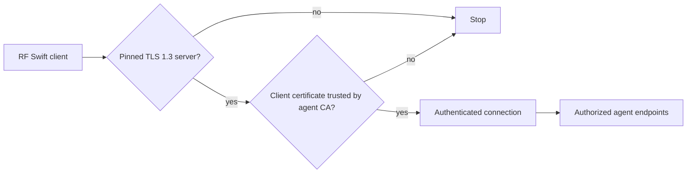
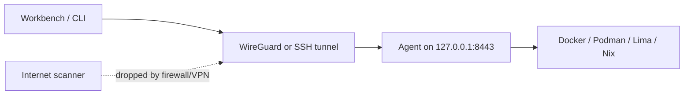
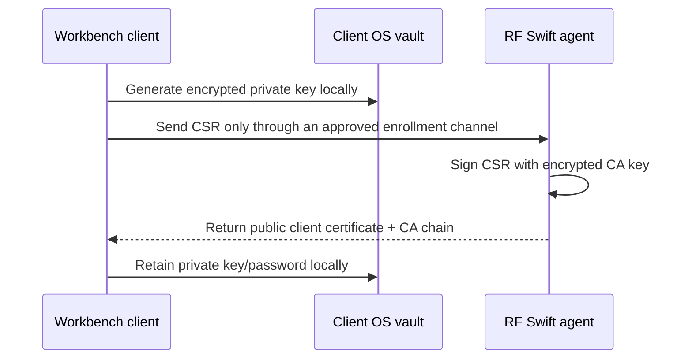

# RF Swift remote agent

The remote agent runs RF Swift engines on a lab machine holding SDR, RFID,
serial, GPU, or other hardware and lets the CLI or Workbench reach it securely.

## Security model

Authentication uses one mechanism: a CA-verified mutual-TLS client certificate.



- TLS 1.3 and a pinned server certificate are mandatory.
- The server verifies the client certificate during the TLS handshake. A client
  without a trusted certificate never reaches HTTP.
- CA, server, and client private keys are password-encrypted PKCS#8 files.
- Random key passwords live in macOS Keychain, Windows Credential Manager, or
  Linux Secret Service. Profiles hold only paths and opaque vault references.
- The password protecting `client-key.pem` protects the credential at rest. It
  is retrieved locally and is never sent to the agent.
- There is no network-password, FIDO2, bearer-token, or plaintext-key fallback.

## VPN-first deployment

Keep the agent on loopback and reach it through WireGuard, another authenticated
VPN, or an SSH tunnel.



An open TCP/TLS port remains detectable when directly exposed. To make it appear
filtered, silently drop unauthorized traffic with the firewall or expose it only
inside the VPN. Do not bind the agent directly to the public Internet.

## Disclosure behavior

Without a trusted client certificate, TLS rejects the connection before HTTP, so
an unauthenticated scanner cannot query `/v1/info`, `/health`, `/metrics`,
`/openapi.json`, versions, engines, or routes. After mTLS authentication,
`/v1/info` may return metadata needed by the legitimate client. Unknown routes
are closed without an HTTP status, headers, body, redirect, or server banner.

New certificates use neutral subjects without RF Swift, Penthertz, usernames, or
friendly agent names. Their intended DNS name/IP remains necessarily visible.
Rotate older bundles to obtain the neutral format.

## Generate certificates from the CLI

### 1. Prepare the secure store

- Linux: use the logged-in non-root desktop user with Secret Service/GNOME
  Keyring/KDE Wallet available.
- macOS: the current user's login Keychain is used.
- Windows: the current user's Credential Manager is used.

RF Swift fails closed if the vault is unavailable.

### 2. Generate a bundle

Use the DNS name/IP clients will use:

```sh
rfswift agent certs init \
  --dir "$HOME/.config/rfswift/remote/lab" \
  --name lab-agent \
  --host localhost
```

The private directory contains:

```text
ca.pem             public CA certificate
ca-key.pem         encrypted CA private key (0600)
server.pem         public server certificate
server-key.pem     encrypted server private key (0600)
client.pem         public initial-client certificate
client-key.pem     encrypted client private key (0600)
bundle.json        paths, fingerprints, and vault references (0600)
```

### 3. Start the agent

Point the agent at the bundle directory. Its `bundle.json` supplies the server
certificate, the encrypted key, the key's vault reference and the client CA:

```sh
rfswift agent --bind 127.0.0.1:8443 --name lab-agent \
  --bundle "$HOME/.config/rfswift/remote/lab"
```

Every item can also be named explicitly, which is what `--bundle` expands to
(`--key` alone is enough for the agent to read the vault reference and the CA
from the `bundle.json` next to it):

```sh
bundle="$HOME/.config/rfswift/remote/lab"
server_key_ref="$(jq -r '.ServerKeyRef' "$bundle/bundle.json")"

rfswift agent \
  --bind 127.0.0.1:8443 \
  --name lab-agent \
  --cert "$bundle/server.pem" \
  --key "$bundle/server-key.pem" \
  --key-ref "$server_key_ref" \
  --client-ca "$bundle/ca.pem"
```

`bundle.json` lives in the directory given to `certs init`, not in the current
directory. The agent refuses to start without the client CA or with an
unencrypted key, and prints its "listening" line only once the key is decrypted
and the socket is bound.

### 4. Give a Workbench on another machine its credentials

The keys in the bundle directory only open with the vault of the user who ran
`certs init`; copying `client-key.pem` elsewhere does not work, and running
`certs init` again on the other machine creates a different CA and server
certificate, which the Workbench then reports as a changed pin. Issue a client
credential file from the agent's bundle instead:

```sh
rfswift agent certs client --bundle "$HOME/.config/rfswift/remote/lab" --name laptop
```

It asks for a transfer passphrase (12 characters or more) and writes
`clients/laptop-client.json`: one JSON file with the CA, a client certificate
signed for `laptop`, that client's private key encrypted with the passphrase
(PKCS#8, scrypt and AES-256-GCM), the agent address and the server fingerprint
to pin. Move the file to the laptop and import it there, either in the
Workbench (**Connection & security → Add agent → Import client credentials**,
which fills the endpoint, fingerprint and secrets location) or on the command
line:

```sh
rfswift agent certs import laptop-client.json --dir "$HOME/.config/rfswift/remote/lab-client"
```

Import checks the certificate against the CA, decrypts the key with the
passphrase and re-encrypts it under a random password in that machine's vault;
the passphrase is not kept. Each machine gets its own certificate, so one can
be recognised by its fingerprint and replaced without touching the others.

The reverse direction exists for a bundle generated in the Workbench:
`rfswift agent certs export --bundle DIR` writes `server-credentials.json`
(server certificate, its key under a passphrase, and the CA that verifies
clients); on the agent host `rfswift agent certs import server-credentials.json
--dir DIR` installs it and `rfswift agent --bundle DIR` starts the agent.

### 4. Optional SSH tunnel

On the Workbench machine:

```sh
ssh -N -L 18443:127.0.0.1:8443 user@lab.internal
```

The local endpoint is `https://localhost:18443`. WireGuard is preferable for a
persistent lab.

## Generate and verify from Workbench

Open **Connection & security → Add agent**.

### Create an agent bundle

1. Enter the agent name and DNS name/IP.
2. Select a private output directory.
3. Select **Generate encrypted bundle**.
4. Workbench calls the shared Go generator directly; vault passwords never
   cross the JavaScript bridge.
5. Start the agent using the command displayed by Workbench
   (`rfswift agent --bundle DIR`) when it runs on this machine.

### Credentials for another machine

Under the bundle form, **Credentials for another machine** writes a credential
file from a bundle folder: **Issue client file** signs a new client certificate
for a named machine and **Export server file** packs this agent's own side.
Both ask for a transfer passphrase and save one JSON file holding every
certificate that side needs and its private key encrypted with the
passphrase. On the other machine, import it: **Import client credentials** in
the connection form (it fills the endpoint, the pinned fingerprint and the
secrets location, then press **Connect**), or `rfswift agent certs import` for
a server file. The transfer passphrase is typed into a Workbench dialog and
handed to the Go side once; it is not stored.

### Verify an existing agent

Enter:

- Agent address, for example `https://localhost:8443`.
- The pinned server SHA-256 fingerprint shown after provisioning.
- The client secrets directory containing `ca.pem`, `client.pem`, and encrypted
  `client-key.pem`.

Workbench derives the vault reference from the selected directory; users do not
need to open or select `bundle.json`. Select **Connect**. Workbench validates TLS
1.3, the pin, CA, client certificate, and encrypted private-key loading. On
success the connection panel confirms the mTLS session and offers Disconnect;
everything else happens through the normal mission views. Requests to the agent
are typed control calls or argument arrays for the remote `rfswift` binary,
never text interpolated into a shell.

After authentication, Workbench switches to the remote engine. The engine
doctor (the Engines chip) then describes the agent host instead of this
machine: every installed engine with its state, the number of RF Swift
containers the agent can list on it, and the agent's reason when it cannot use
one, plus whether Nix is installed there. Engines are managed on the agent
host itself; the doctor only shows them. Mission listing,
inspection, container/Nix creation, image checks and pulls, start/stop, deletion,
container configuration, interactive terminals, and mission-workspace artifacts
are routed to the agent. There is no fallback to the GUI host. Use **Disconnect**
to explicitly return to local IPC.

Workbench can save multiple named agent configurations. A saved entry contains
only the endpoint, pinned server fingerprint, and credential-directory path.
Certificates remain in that directory; the encrypted private-key password stays
in the native OS vault. Removing a saved entry does not delete either one.

Remote workspace files are listed without reading their contents. Preview is
limited to text, and registration copies the selected file into the local mission
evidence store over authenticated mTLS. Paths are confined to the inspected
mission workspace, symlinks cannot escape it, listings stop at 5,000 files, and
individual transfers are limited to 16 MiB.

## Cross-machine enrollment

The supported way to enrol another machine is the credential file above: the
agent's CA signs a fresh client certificate, and only that client's key travels,
under a passphrase, to be re-wrapped into the destination vault. A pin mismatch
("agent certificate pin changed") on connect means the client file came from a
different bundle than the one the agent runs with, or that the agent's bundle
was regenerated; issue a new client file from the agent's current bundle.

A CSR flow, where the client's private key is generated on the client and only
a signing request travels, remains the stricter option for the future:



The CSR endpoint is pending. The initial client certificate of a bundle is
usable only by the OS account/vault that generated it; copying `client-key.pem`
without re-wrapping its vault password will not work, which is what the
credential file and `certs import` do for you.

## Windows

Both roles work on Windows (verified on Windows 11 with Docker Desktop):

- **Agent host**: `rfswift agent certs init` stores the key passwords in the
  current user's Credential Manager and `rfswift agent` serves TLS 1.3 + mTLS
  from `rfswift.exe`. Run it in a session of the same Windows user that
  generated the bundle (a scheduled task or service under another account has
  no access to that vault). Interactive terminals are served through a Windows
  pseudo console (ConPTY, Windows 10 1809+), so remote shells into Docker
  Desktop containers behave like on Linux; the Windows-side facilities (usbipd
  passthrough, WSLg display/audio) apply to containers created through the
  agent as well.
- **Workbench client**: connects to a Linux, macOS, or Windows agent with the
  same pinned TLS 1.3 + mTLS flow; the encrypted client key password lives in
  Credential Manager. Remote terminals, artifacts, audits, creation and
  lifecycle are routed to the agent exactly as on other hosts.

Windows ignores POSIX file modes, so the `0600` on key files documents the
intent rather than an enforced ACL there: keep the bundle directory inside the
user profile (its default ACL already restricts other accounts).

## Tests and fuzzing

```sh
./scripts/test-remote.sh unit
RFSWIFT_FUZZ_TIME=30s ./scripts/test-remote.sh fuzz
./scripts/test-remote.sh all
```

CI covers encrypted PKCS#8 parsing, wrong passwords, malformed certificates,
fingerprints, mandatory mTLS policy, silent unknown routes, and neutral
certificate subjects.

## Common failures

| Error | Action |
| --- | --- |
| `secure store: ...` | Unlock/start the current non-root user's native vault. |
| `secret not found in keyring` | Use the matching reference from `bundle.json`; the error names the reference and key file it tried. |
| `encrypted private key requires a secure-store reference` | `--key-ref` was empty (often a `jq` line that could not find `bundle.json`). Pass `--bundle DIR` instead, or read the reference from `DIR/bundle.json`. |
| `agent certificate pin changed` | The pinned fingerprint belongs to another bundle's server certificate. Pin the one printed by `certs init` on the agent host, or import a client file issued from the agent's bundle (`certs client`). |
| `wrong passphrase, or the credential file is damaged` | The transfer passphrase typed at import differs from the one chosen at issue time. Issue a new file if it was lost. |
| `read client CA ... no such file` | `--client-ca` must be the bundle's `ca.pem` file, not a vault reference. |
| `missing --cert, --key, ...` | Pass `--bundle DIR`, or every file and the reference explicitly. |
| Connected, but no containers are listed | Open the engine doctor (Engines chip): while connected it shows the agent host's engines as the agent's own user sees them, with the reason an engine is unreachable. A Docker socket the agent's user cannot open ("permission denied") means the user joined the `docker` group after the agent's session started: log that user out and in (or `newgrp docker`) and restart the agent. Only containers carrying the `org.container.project=rfswift` label (every container RF Swift creates) are listed. |
| `private key must be ... encrypted PKCS#8` | Use a generated encrypted key; plaintext/legacy PEM is rejected. |
| `cannot decrypt private key` | Match the key file with its original vault reference. |
| `client CA is required` | Pass `ca.pem` using `--client-ca`. |
| TLS hostname error | Regenerate for the DNS name/IP used by the client. |

## Status

Implemented: TLS 1.3, pinning, mandatory mTLS, encrypted PKCS#8 keys, native OS
vault integration, CLI/GUI bundle generation, GUI mTLS verification, neutral
certificate subjects, disclosure hardening, unit tests, fuzzing, and CI.

Pending: client-local CSR enrollment/revocation and the CLI/TUI client connection
workflow. Remote environment audits remain separate from mission findings.
