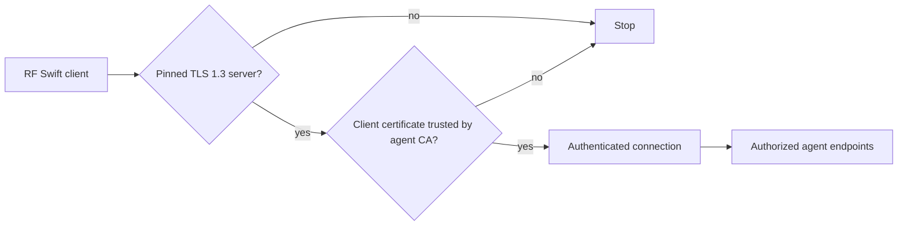
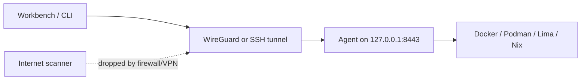
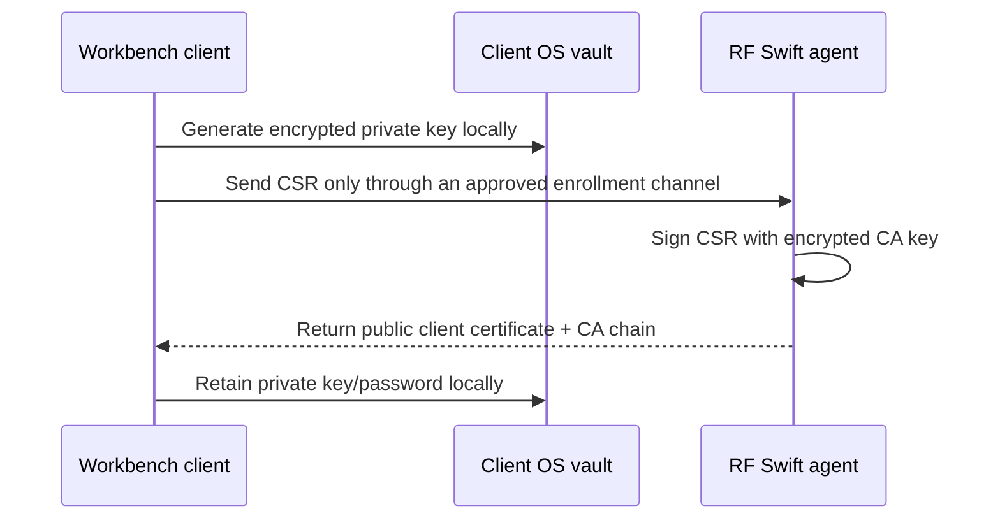

# RF Swift remote agent

The remote agent runs RF Swift engines on a lab machine holding SDR, RFID,
serial, GPU, or other hardware and lets the CLI or Workbench reach it securely.

## Security model

Authentication uses one mechanism: a CA-verified mutual-TLS client certificate.



- TLS 1.3 and a pinned server certificate are mandatory.
- The server verifies the client certificate during the TLS handshake. A client
  without a trusted certificate never reaches HTTP.
- CA, server, and client private keys are password-encrypted PKCS#8 files.
- Random key passwords live in macOS Keychain, Windows Credential Manager, or
  Linux Secret Service. Profiles hold only paths and opaque vault references.
- The password protecting `client-key.pem` protects the credential at rest. It
  is retrieved locally and is never sent to the agent.
- There is no network-password, FIDO2, bearer-token, or plaintext-key fallback.

## VPN-first deployment

Keep the agent on loopback and reach it through WireGuard, another authenticated
VPN, or an SSH tunnel.



An open TCP/TLS port remains detectable when directly exposed. To make it appear
filtered, silently drop unauthorized traffic with the firewall or expose it only
inside the VPN. Do not bind the agent directly to the public Internet.

## Disclosure behavior

Without a trusted client certificate, TLS rejects the connection before HTTP, so
an unauthenticated scanner cannot query `/v1/info`, `/health`, `/metrics`,
`/openapi.json`, versions, engines, or routes. After mTLS authentication,
`/v1/info` may return metadata needed by the legitimate client. Unknown routes
are closed without an HTTP status, headers, body, redirect, or server banner.

New certificates use neutral subjects without RF Swift, Penthertz, usernames, or
friendly agent names. Their intended DNS name/IP remains necessarily visible.
Rotate older bundles to obtain the neutral format.

## Generate certificates from the CLI

### 1. Prepare the secure store

- Linux: use the logged-in non-root desktop user with Secret Service/GNOME
  Keyring/KDE Wallet available.
- macOS: the current user's login Keychain is used.
- Windows: the current user's Credential Manager is used.

RF Swift fails closed if the vault is unavailable.

### 2. Generate a bundle

Use the DNS name/IP clients will use:

```sh
rfswift agent certs init \
  --dir "$HOME/.config/rfswift/remote/lab" \
  --name lab-agent \
  --host localhost
```

The private directory contains:

```text
ca.pem             public CA certificate
ca-key.pem         encrypted CA private key (0600)
server.pem         public server certificate
server-key.pem     encrypted server private key (0600)
client.pem         public initial-client certificate
client-key.pem     encrypted client private key (0600)
bundle.json        paths, fingerprints, and vault references (0600)
```

### 3. Start the agent

```sh
bundle="$HOME/.config/rfswift/remote/lab"
server_key_ref="$(jq -r '.ServerKeyRef' "$bundle/bundle.json")"

rfswift agent \
  --bind 127.0.0.1:8443 \
  --name lab-agent \
  --cert "$bundle/server.pem" \
  --key "$bundle/server-key.pem" \
  --key-ref "$server_key_ref" \
  --client-ca "$bundle/ca.pem"
```

The agent refuses to start without the client CA or with an unencrypted key.

### 4. Optional SSH tunnel

On the Workbench machine:

```sh
ssh -N -L 18443:127.0.0.1:8443 user@lab.internal
```

The local endpoint is `https://localhost:18443`. WireGuard is preferable for a
persistent lab.

## Generate and verify from Workbench

Open **Connection & security → Add agent**.

### Create an agent bundle

1. Enter the agent name and DNS name/IP.
2. Select a private output directory.
3. Select **Generate encrypted bundle**.
4. Workbench calls the shared Go generator directly; passwords never cross the
   JavaScript bridge.
5. Start the agent using the command displayed by Workbench.

### Verify an existing agent

Enter:

- Agent address, for example `https://localhost:8443`.
- The pinned server SHA-256 fingerprint shown after provisioning.
- The client secrets directory containing `ca.pem`, `client.pem`, and encrypted
  `client-key.pem`.

Workbench derives the vault reference from the selected directory; users do not
need to open or select `bundle.json`. Select **Connect**. Workbench validates TLS
1.3, the pin, CA, client certificate, and encrypted private-key loading. Success
opens an authenticated RF Swift command panel. Commands are sent as argument
arrays to the remote `rfswift` binary rather than interpolated into a shell.

After authentication, Workbench switches to the remote engine. Mission listing,
inspection, container/Nix creation, image checks and pulls, start/stop, deletion,
container configuration, interactive terminals, and mission-workspace artifacts
are routed to the agent. There is no fallback to the GUI host. Use **Disconnect**
to explicitly return to local IPC.

Workbench can save multiple named agent configurations. A saved entry contains
only the endpoint, pinned server fingerprint, and credential-directory path.
Certificates remain in that directory; the encrypted private-key password stays
in the native OS vault. Removing a saved entry does not delete either one.

Remote workspace files are listed without reading their contents. Preview is
limited to text, and registration copies the selected file into the local mission
evidence store over authenticated mTLS. Paths are confined to the inspected
mission workspace, symlinks cannot escape it, listings stop at 5,000 files, and
individual transfers are limited to 16 MiB.

## Cross-machine enrollment

Never push the client private key to the agent. Generate it on the client and
send only a certificate signing request:



The CSR endpoint is pending. Until implemented, the initial client certificate
is usable only by the OS account/vault that generated it. Copying
`client-key.pem` without securely re-wrapping its vault password will not work.

## Windows

Both roles work on Windows (verified on Windows 11 with Docker Desktop):

- **Agent host**: `rfswift agent certs init` stores the key passwords in the
  current user's Credential Manager and `rfswift agent` serves TLS 1.3 + mTLS
  from `rfswift.exe`. Run it in a session of the same Windows user that
  generated the bundle (a scheduled task or service under another account has
  no access to that vault). Interactive terminals are served through a Windows
  pseudo console (ConPTY, Windows 10 1809+), so remote shells into Docker
  Desktop containers behave like on Linux; the Windows-side facilities (usbipd
  passthrough, WSLg display/audio) apply to containers created through the
  agent as well.
- **Workbench client**: connects to a Linux, macOS, or Windows agent with the
  same pinned TLS 1.3 + mTLS flow; the encrypted client key password lives in
  Credential Manager. Remote terminals, artifacts, audits, creation and
  lifecycle are routed to the agent exactly as on other hosts.

Windows ignores POSIX file modes, so the `0600` on key files documents the
intent rather than an enforced ACL there: keep the bundle directory inside the
user profile (its default ACL already restricts other accounts).

## Tests and fuzzing

```sh
./scripts/test-remote.sh unit
RFSWIFT_FUZZ_TIME=30s ./scripts/test-remote.sh fuzz
./scripts/test-remote.sh all
```

CI covers encrypted PKCS#8 parsing, wrong passwords, malformed certificates,
fingerprints, mandatory mTLS policy, silent unknown routes, and neutral
certificate subjects.

## Common failures

| Error | Action |
| --- | --- |
| `secure store: ...` | Unlock/start the current non-root user's native vault. |
| `secret not found in keyring` | Use the matching reference from `bundle.json`. |
| `private key must be ... encrypted PKCS#8` | Use a generated encrypted key; plaintext/legacy PEM is rejected. |
| `cannot decrypt private key` | Match the key file with its original vault reference. |
| `client CA is required` | Pass `ca.pem` using `--client-ca`. |
| TLS hostname error | Regenerate for the DNS name/IP used by the client. |

## Status

Implemented: TLS 1.3, pinning, mandatory mTLS, encrypted PKCS#8 keys, native OS
vault integration, CLI/GUI bundle generation, GUI mTLS verification, neutral
certificate subjects, disclosure hardening, unit tests, fuzzing, and CI.

Pending: client-local CSR enrollment/revocation and the CLI/TUI client connection
workflow. Remote environment audits remain separate from mission findings.
