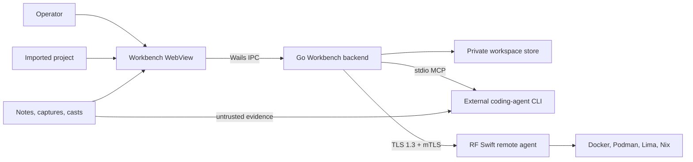

# RF Swift Workbench security audit

Date: 2026-08-26  
Scope: Workbench project import/export, rendered notes and reports, Wails IPC,
mission-scoped MCP, secrets metadata, and the RF Swift remote-agent transport.

## Trust boundaries



Evidence is never an authority. Text in a note, artifact, filename, decoded
recording, terminal output, or remote metadata can contain prompt injection and
must be treated as untrusted data. MCP write and execute capabilities remain
separate operator-selected permissions; model prompts are defense in depth, not
an authorization boundary.

## Confirmed issues corrected

| Boundary | Finding | Resolution |
|---|---|---|
| Project/remote metadata → WebView | Mission IDs and custom icons reached `innerHTML` without escaping, enabling stored DOM injection from a crafted imported project or authenticated remote response. | Escape dynamic values and gate them with frontend regression checks. |
| Markdown → WebView | Link targets accepted active URI schemes such as `javascript:`. | Allow only HTTP(S); images additionally allow constrained image data URLs and managed assets. |
| Wails IPC → filesystem | Terminal playback accepted any readable absolute `.cast` path. | Resolve symlinks and require a regular file inside managed mission recordings/captures. |
| Note assets → filesystem | A symlink under `notes/assets` could escape the managed directory. | Resolve both root and target and enforce containment. |
| Mission persistence/MCP | IDs were not validated in the store and an unscoped MCP server could write into a valid-looking mission that did not exist. | Validate single path components and require an existing mission. |
| ZIP import → disk | The 20 GiB limit trusted declared uncompressed sizes while the copy itself was not bounded. | Bound actual bytes written and abort/clean the import on overflow. |
| Remote TLS | Naive host splitting broke IPv6; fingerprint mode bypassed expiry and, when a CA was supplied, chain/hostname validation. | Parse endpoints as URLs, enforce certificate lifetime, and verify CA/hostname in pin+CA mode. |
| Remote posture | `/v1/info` claimed rate limiting although none existed; its client decode was unbounded. | Report the true state and cap the decoded response at 1 MiB. |

## Prompt-injection controls

- MCP evidence tools label responses `untrusted_evidence` and explicitly tell
  clients to ignore embedded prompts, role changes, approval claims, and tool
  requests.
- Artifact bytes remain inaccessible until registered and approved for AI
  content access; binary files are not silently converted into instructions.
- Mission scoping is enforced by the server, independent of agent behavior.
- Secret values are not returned by listing/evidence tools and are excluded
  from reports and project exports.
- Write and command tools are exposed only when their respective MCP permission
  is enabled. Fully automatic/YOLO model operation cannot make untrusted model
  output safe; use it only with the minimum tool permissions required.

## Reproducing the security checks

From `go/rfswift-workbench`:

```bash
make security-test
```

The runner executes all Go tests, integration tests, `go vet`, JavaScript syntax
and sink guards, then short fuzz campaigns. Increase the local campaign time:

```bash
FUZZ_TIME=60s scripts/security-test.sh
```

GitHub Actions runs the same script on pushes to `main` and `v4.0.0-dev`, pull
requests that touch the CLI/Workbench, tagged Workbench builds, and manual
dispatches. The CI smoke duration is deliberately short; scheduled long-running
fuzzing remains a recommended follow-up.

## Remaining hardening work

- Replace the handcrafted Markdown renderer with a well-maintained sanitizer
  policy or a Trusted Types-compatible rendering pipeline; current allowlists
  and regression guards cover confirmed sinks but are not a formal HTML parser.
- Make all private metadata writes atomic and no-follow to reduce same-user or
  writable-bind symlink/partial-write races.
- Add an actual per-client remote-agent rate limiter before advertising it, and
  stream/cap command output at the producer rather than only at the client.
- Separate legacy recording auto-registration during evidence reads from the
  nominally read-only MCP operation.
- Run browser-level WebView tests on hostile imported projects in addition to
  the fast CI sink guards.
