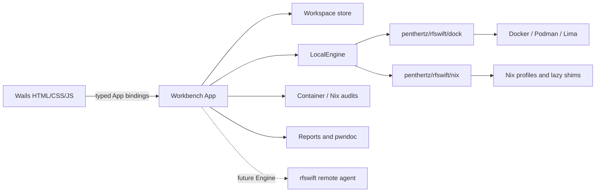

# RF Swift Workbench - GUI architecture

A research and assessment workspace GUI for RF Swift, delivered with Wails so it
stays a Go project and reuses the existing engine, audit and catalog code. The
Workbench is implemented at `go/rfswift-workbench/`; this document records both
the live architecture and the remaining boundaries.



## Why Wails

- RF Swift is Go. Wails binds Go methods straight to the frontend, so the GUI
  calls the existing `nix`, `dock` and audit packages directly - no second
  language and no re-implemented engine glue (a Tauri/Rust backend would need
  both).
- Single binary per platform, using the OS webview (no bundled browser).
- Same frontend (HTML/CSS/JS) as the prototype.

## Cross-platform (Linux, macOS, Windows)

Wails targets all three; the plan keeps them first-class:

- Webview per OS: WebView2 on Windows, WKWebView on macOS, WebKitGTK on Linux.
  The frontend is plain HTML/CSS/JS (no OS assumptions).
- The backend code is already cross-platform: the container audit and image
  audit drive the `docker`/`podman` CLI (not a host-specific socket), the image
  scan uses `save` + `--input`, and USB is handled per-OS (`usb` dispatches to
  the macOS/Windows backends).
- Paths via `path/filepath` and the existing `homeDir()` helper (honours
  SUDO_USER); no hardcoded separators.
- Build: `wails build` per platform in CI (windows/amd64, darwin/arm64 +
  darwin/amd64, linux/amd64 + linux/arm64), reusing the release signing work.
- Terminal: a cross-platform PTY (e.g. creack/pty on unix, ConPTY on Windows)
  bridged to an xterm.js panel; fall back to line-mode where a PTY is
  unavailable.

## Engine-agnostic (docker, podman, lima, nix)

The GUI is not tied to one engine. It works across all four RF Swift engines,
the same way the CLI does:

- Docker and Podman: containers via the existing `dock` package (both drive the
  same CLI surface).
- Lima: containers inside a Lima VM (macOS/Windows), through the same engine
  abstraction and `--engine`/`RFSWIFT_ENGINE` selection.
- Nix: native environments (no daemon, no container) via the `nix` package.
- A target list unifies all of them, so a workspace can mix, e.g., a Docker RFID
  container, a native Nix SDR env and a Lima reversing VM; the UI shows each
  target's engine and filters by it.
- Audit adapts to the engine: `dock.AuditImage` / `dock.AuditContainer` for
  container engines, `nix.RunAudit` for Nix environments - all normalised to the
  same posture shape (crit/high/med/low) the panels render.

## Backend API (bound Go methods)

Thin bindings over code that already exists, plus a workspace store:

- Workspace: list, create/open and select a workspace dir; current selection.
- Engines: enumerate available engines; per-target engine; honour the active
  `--engine` / `RFSWIFT_ENGINE` / config default.
- Targets: list containers (docker/podman/lima via `dock`) and Nix environments
  (via `nix`) as one list; `inspect`, start/stop/enter/run.
- Audit: run env/image/container audit (reuse `nix.RunAudit`, `dock.AuditImage`,
  `dock.AuditContainer`) and read back `report.json` for the posture panels.
- Catalog/search/install: reuse `nix` catalog, `SearchPackages`,
  `InstallPackages`, and the container `install` function list.
- Notebook: CRUD markdown files under the workspace `notes/`.
- Captures: import/copy and catalog `captures/` with metadata; classify each file by
  extension into a type (IQ, Flipper, Proxmark, pcap, firmware/binary, doc, ...);
  "open in tool" launches the type's tool (inspectrum/qFlipper/pm3/wireshark/
  ghidra/...). Capture types are extensible: the user can define a custom type
  with a name, an icon, and the extensions that map to it; those extensions then
  auto-classify. Built-in types come from Go and custom types persist in the
  selected workspace.
- Findings: read/write `findings.json`.
- USB passthrough: `USBBackend`/`ListHostUSB`/`VMUSBInfo` plus
  `AttachHostUSB`/`DetachHostUSB` (macOS: Lima QMP hot-plug) and
  `AttachWinUSB`/`DetachWinUSB`/`UnshareWinUSB` (Windows: usbipd-win into the
  WSL 2 VM). On Windows only sharing a device needs administrator rights; the
  backend requests them once per device through a UAC prompt for `usbipd.exe`
  and keeps attach/detach unprivileged.

## Interaction model (missions + dockable panels)

- The left rail lists **missions** - one per target (a Docker/Podman/Lima
  container or a Nix environment), filterable by engine, each showing status and
  worst-finding severity.
- A mission maps to one target (container/env) and represents one pentest.
  Container missions can be started and stopped from the mission bar. Nix
  environments are native closures rather than daemons, so they deliberately
  have no start/stop lifecycle; their commands run through the console with the
  same eager profile, lazy shim and workspace semantics as the CLI.
- Reports and pwndoc exports are per mission (one pentest = one report), not
  workspace-wide.
- Opening a mission shows its panels - Console, Notebook, Config & network,
  Findings, Captures and an optional AI assistant - as **draggable tabs** that can
  be split into **resizable columns** (drag a tab beside another to make a column;
  drag onto a column to stack). A column can be **maximized** to hide the others
  and focus one panel, then restored. Each mission keeps its own layout, persisted
  per workspace.
- Findings are editable like a pwndoc vulnerability (type, CVSS v3, description,
  observation, remediation, references, PoC) and export/import as pwndoc JSON.
  Notes and findings embed screenshots/photos and code blocks in any language.
- Report and pwndoc JSON export/download use the native Wails save dialog in the
  app; Markdown reports can also be written directly into the mission's
  `reports/` directory.
- A per-mission console runs scripts, CLI and GUI tools in that target; audit and
  "open capture" actions route into it.

## On-disk workspace (dedicated, portable)

Everything an assessment produces lives under one directory, so a workspace is
self-contained and can be archived or shared:

```
~/.rfswift/workspaces/<name>/
  workspace.json        # metadata: name, created, containers referenced
  notes/                # markdown notebook (exportable as-is)
  captures/             # iq/, flipper/, binaries/ with sidecar .meta.json
  findings.json         # tagged, ranked findings
  reports/              # audit reports (json/html/pdf) per target
```

This mirrors the existing Nix workspace and works with `nix export`/`import`.

## Status

The Wails module is a separate binary and Go module from the lean CLI because it
carries cgo and webview dependencies. Through a local module replacement it
links the existing `penthertz/rfswift/{nix,dock}` packages directly; it does not
shell out to the RF Swift CLI or parse its presentation output.

It builds: `wails build` produces the binary and generates the typed JS bindings,
verified on Linux (webkit2gtk-4.1) and as a cross-built Windows `.exe`. A `Makefile`
encodes the release matrix and `.github/workflows/workbench.yml` builds it on
native runners. The CLI is a single static binary everywhere; a webview app
cannot be a static ELF on Linux (it links GTK+WebKit), so the portable per-arch
artifacts are: a self-contained `.exe` (Windows), a self-contained `.app`
(macOS), and a single-file AppImage plus a distro-linked binary (Linux).

Engine wired: `LocalEngine` now drives the real engines through the rfswift
`dock`/`nix` packages - `ListTargets` returns live containers (active engine) +
Nix environments; `Inspect` reads a container's config/network via the routed
moby client (or `GetEnvironment` for Nix); `Start`/`Stop` operate on containers;
`Audit` runs the container/Nix audit and parses `report.json` into a posture.

Frontend wired: the UI calls generated bindings (`window.go.main.App.*`) for
workspaces, live missions, inspection, lifecycle, notes, findings, real capture
file import, audits, backend-generated reports/pwndoc, native save dialogs,
connection audits, AI configuration and AI chat. The console executes one
non-interactive command per request in both containers and Nix environments.
Mock data remains only as a standalone-browser preview and is replaced when the
Wails backend appears. Theme and dock layout remain browser-local UI settings.

Current verification: Go tests and vet pass, the embedded JavaScript parses, and
a production Linux amd64 Wails build with generated bindings succeeds.

Remaining architecture work: implement the separately specified `rfswift
agent` protocol and a remote `Engine`; add a streaming PTY for long-lived
interactive sessions; and add workspace archive/delete operations. Until the remote transport exists,
only the truthful in-process local connection is exposed.
